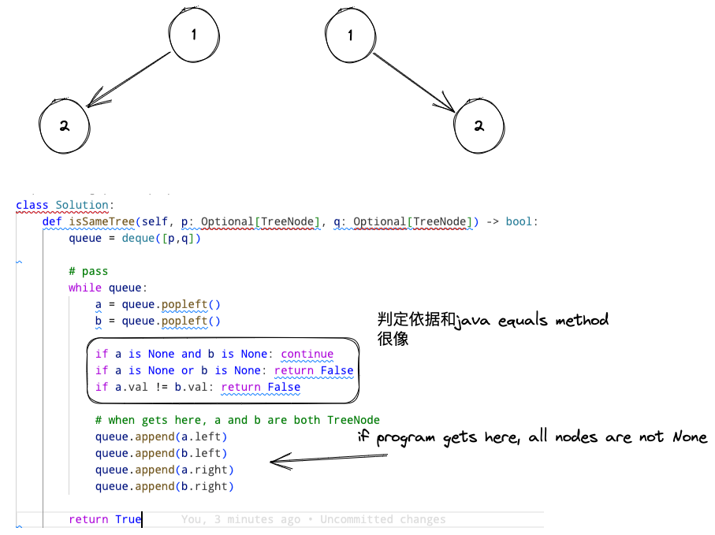

# Problem

Given the roots of two binary trees `p` and `q`, write a function to check if they are the same or not.

Two binary trees are considered the same if they are structurally identical, and the nodes have the same value.

Example
```
    1
   / \
  2   3

VS 

    1
   / \
  3   2
```

```
output: False
```

## Intuition
If a tree `p` and a tree `q` are the same, they must possesses the following two conditions
- **Condition1**: tree `p` and `q` has the same structure
- **Condition2**: values in p and q are the same.

If order to do that, we need to do some sort of traversal to examine the above two conditions. The takeaway for this problem is illustrated in the box in the diagram below
- if two nodes are both `None`, (still valid but we don't want to append None in the queue, so `continue`)
- if one of them not None while the other is None, **condition 1 not met.**
- if value is not same, **condition 2 not met.**

Now, you should have a clearer picture on the thought process.



