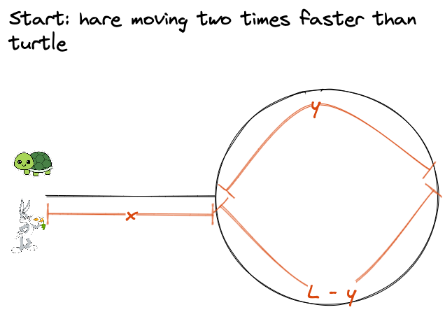
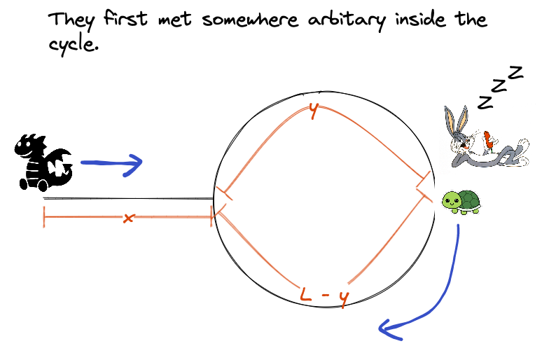
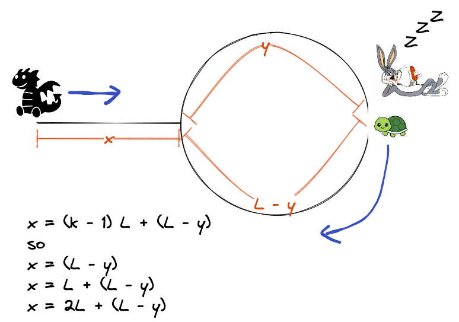

# Problem

Given the `head` of a linked list, return the node where the cycle begins. If there is no cycle, return `null`.

There is a cycle in a linked list if there is some node in the list that can be reached again by continuously following the `next` pointer. Internally, `pos` is used to denote the index of the node that tail's `next` pointer is connected to (0-indexed). It is `-1` if there is no cycle. Note that `pos` is not passed as a parameter.

Do not modify the linked list.

Example 1:


```plaintext
Input: head = [3,2,0,-4], pos = 1
Output: tail connects to node index 1
Explanation: There is a cycle in the linked list, where tail connects to the second node.
```


# Intuition

Recall the floyd's hare and turtle for cycle detection as illustrated in the figure below. If we label the length, we have the following

|symbol|description|
|---|---|
|$L$|length of the cycle|
|$x$|the distance from the `head` to the start of the cycle|
|$y$|the distance from the start of the cycle to the position they met|



If the hare is moving at a speed two-times faster than the hare, they will meet with each other at an arbitrary location inside the cycle. Now two things happen:
- bugs bunny starts to nap
- a dragon appears and starts to move at the same speed as the turtle from the `head`




Then the dragon and the hare will meet up at the start of the cycle. But how? Please see the proof section.


# Math proof

Let's assume 
$$
\begin{align}
d_{1} = x + y + n_1\times L \\
d_{2} = x + y + n_2\times L
\end{align}
$$
where $d_{1}$ and $d_{1}$ are the distance covered by the turtle and the hare, respectively, and $n_1$ and $n_2$ are the distance number of cycles taken by the turtle and hare, respectively.

Since we know that the speed of hare is two times faster than the turtle and they start their racing at the `head` simultaneously. Then the distance traveled by the hare will be exactly two-times the distance traveled by the turtle, which means
$$
\begin{align}
2d_1 = d_2
\end{align}
$$

Then we substitute equations 1 and 2 into 2,
$$
\begin{align}
    2d_1 &= d_2 \\
    2x + 2y + 2n_1L &= x + y + n_2L \\
    x + y + (2n_1 - n_2)L &= 0 \\
    x &= (n_2 - 2n_1)L - y \geq 0
\end{align}
$$
where $n_2,n_1 \in Z$

From equations 7, we know $L>y$ and $x>0$, then we have

$$
k = n_2 - 2n_1 \geq 1
$$
where k is 大于等于1的正整数.

Let's do some trick with the equation 7
$$
\begin{align}
    x &= kL - y \\
    x &= \left(k-1\right)L + \left(L - y\right) \\
\end{align}
$$
where $k-1\geq0$

Let's recall this graph, if now, there is a dragon starting from `head` and moving at the same speed as the turtle. Since the distance from `head` to start of cycle, $x$ will always satisfy the equation 9, then dragon and the turtle will meet at the start of the cycle.




# Solution

```python
class Solution:
    def detectCycle(self, head: Optional[ListNode]) -> Optional[ListNode]:
        slow = head
        fast = head

        while fast and fast.next:
            slow, fast = slow.next, fast.next.next

            if slow == fast:
                curr = head
                while curr != slow:
                    curr, slow = curr.next, slow.next
                
                return curr


        # no cycle at all
        return None
```