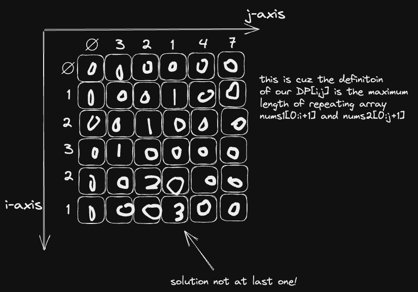

# Approach

- `DP[i,j]` is defined as the maixmum repeating prefix array ending with num1[i] and num2[j] (inclusive). 必须要用这俩点为结尾.

$$
DP[i,j] = \begin{cases}
    DP[i-1][j-1] + 1 &if\:nums[i]\neq nums[j]\\
    0 &if\:nums[i]= nums[j]
\end{cases}
$$

> 关键点在于prefix arraying endign with nums[i] and nums[j]. 如果最后一个element不相等，则这俩subarray必然不repeating



## Not optimized code
```python
class Solution:
    def findLength(self, nums1: List[int], nums2: List[int]) -> int:
        # DP[i,j]: maximum length of list ending on nums1[i] and nums2[j]

        m = len(nums1)
        n = len(nums2)

        DP = [[0] * (n+1) for _ in range(m+1)]
        
        for i in range(1,m+1):
            for j in range(1,n+1):
                if nums1[i-1] == nums2[j-1]:
                    # 相等,info from the top
                    DP[i][j] = DP[i-1][j-1] + 1
                else:
                    # 既然俩array, last element不等，那么它们必然不share repeating array ending on nums1[i] and num2s[j]
                    DP[i][j] = 0
        
        return max(max(row) for row in DP)

```


## Optimized code

```python
class Solution:
    def findLength(self, nums1: List[int], nums2: List[int]) -> int:
        # DP[i,j]: maximum length of repeated subarray ending on nums1[i] and nums2[j]

        m = len(nums1)
        n = len(nums2)
        
        last_row = [0 for _ in range(n+1)]
        DP = [0 for _ in range(n+1)]
        max_length = 0
        

        # left right scan
        for i in range(1,m+1):
            for j in range(1,n+1):
                if nums1[i-1] == nums2[j-1]:
                    # 相等,info from the top left
                    DP[j] = last_row[j-1] + 1
                else:
                    DP[j] = 0
                # update max_length
                max_length = max(DP[j],max_length)

            # update it
            last_row = DP.copy()
        
        return max_length
```
