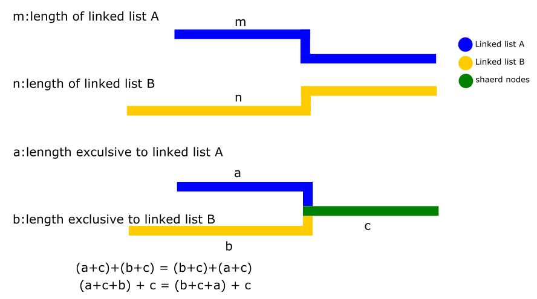

# Approach 1: smart two-pointer solution 
<!-- Describe your approach to solving the problem. -->
这个解法很漂亮, 假设俩linked list A and B, A的长度为m, B的长度为n, 我们设置俩指针`pointerA` and `pointer B` traverse both linked list, 当其中任意一个pointer走完那个linked list之后，我们loop back to another linked list, 假设linked list A and B相交，那么当这俩指针相遇的点，必然是交点



可能有些费解的话看上图, 假设链表A长度为m 链表B长度为n, 假设链表A与链表B相交，那么exclusive to 链表A的长度为a, exclusive to链表B的长度为b, 共享长度为c, 那么以下等式必满足:
$$
\begin{align}
(a+b) + (b+c) &= (b+c) + (a+c)\\
(a+b+c) + c &= (a+b+c) +c
\end{align} 
$$

$(a+b+c)$为:
- pointer A从head of linked list A开始走，走到头后，再从linked list B的开头走，再走到交点的距离.
- pointer B从head of linked list B开始走，走到头后，再从linked list A的开头走，再走到交点的距离.

基于这个我们理解，我们就可以写算法了

## Intuition
<!-- Describe your first thoughts on how to solve this problem. -->

做了一张gif, 来很好的诠释了这个算法


> Note: in python, `None` is stored at a specific location. `None == None`是恒成立的


## Algorithm:
- set two pointers `pA` and `pB` at the start of linked list A and B, respectively
- while `pA != pB`, `pA` and `pB` traverse down linked A and linked list B, if one of pointer reaches the `None`, redirect to another linked list (走完A的走B, 走完B的走A)
- 三种情况:
  - linked list A and B相交，在第二圈交点相遇
  - linked list A and B不相交且长度不等, 在第二圈终点相遇
  - linked list A and B不相交且长度相等, 在第一圈终点相遇, 由于`None== None` returns true.
  
  
## Complexity
- Time complexity: $O(2m+2n)\approx O(m+n)$ where m and n are length of linekd list A and B, respectively.如果俩linked list相交，那么需要traverse每个linked list至少两次(a+b+c)次 to be exact. 但如果俩不相交，且长度不等，2m+2n次. 但如果不相交且长度相等m+n次.

<!-- Add your time complexity here, e.g. $$O(n)$$ -->

- Space complexity: $O(1)$
<!-- Add your space complexity here, e.g. $$O(n)$$ -->

## Code
```python
# Definition for singly-linked list.
# class ListNode:
#     def __init__(self, x):
#         self.val = x
#         self.next = None

class Solution:
    def getIntersectionNode(self, headA: ListNode, headB: ListNode) -> Optional[ListNode]:
        probeA = headA
        probeB = headB

        while probeA != probeB:
            if probeA is None:
                probeA = headB
            else:
                probeA = probeA.next
            
            if probeB is None:
                probeB = headA
            else:
                probeB = probeB.next

        # if no intersection, both probe points to null
        # if intersect, both at same place
        return probeA
            
```


# Approach 2: normal two pointer solution
<!-- Describe your approach to solving the problem. -->

如果两个linked list相交, 那把这俩linekd list, 在tail侧对齐后，所有的可能性如下图所示


我们只需要比较较短的链表中的每个node with its corresponding node (叫做node pair), 进行比较，就可以获得答案了;

## Algorithm
<!-- Describe your first thoughts on how to solve this problem. -->

- 设置俩指针at the start of linked list A and B
- traverse down both linekd list to find their length m and n, assuming n is the smaller length
- compare every node within the shorter linked list with length n starting from top with n-m th node from the longer linked list to the end. 

## Complexity
- Time complexity: $O(m+n)$, with m and n are length of the two input linked list, respectively
<!-- Add your time complexity here, e.g. $$O(n)$$ -->

- Space complexity: $O(1)$
<!-- Add your space complexity here, e.g. $$O(n)$$ -->

## Code
```python
# Definition for singly-linked list.
# class ListNode:
#     def __init__(self, x):
#         self.val = x
#         self.next = None

class Solution:
    def getLength(self,head):
        # return the length of the linked list
        probe = head
        count = 0

        while probe:
            count += 1
            probe = probe.next

        return count

    def getIntersectionNode(self, headA: ListNode, headB: ListNode) -> Optional[ListNode]:
        # two-pointer Solution
        # step 1: traverse both both linked list and count # of nodes in both
        # step 2: assuming two linked list has length m and n, and m is the smaller one. compare the shorter linked list n nodes, with the last n nodes of the linked list with length m
        
        # length of linekd list A and B  
        m = self.getLength(headA)
        n = self.getLength(headB)

        # min and max length of the two linked list
        if m <= n:
            min_ll,max_ll = m,n
            short_ll,long_ll = headA, headB
        else:
            min_ll,max_ll = n,m
            short_ll,long_ll = headB, headA

        # set up two pointer, one at the start of shorter linked list, another one max-min away from the start position of the longer linked list
        probe_short = short_ll
        probe_long = long_ll

        for i in range(max_ll - min_ll):
            probe_long = probe_long.next
        
        while probe_short and probe_long:
            if probe_short == probe_long:
                return probe_short

            probe_long = probe_long.next
            probe_short = probe_short.next

        return None
```

# Approach 3: Hash solution
<!-- Describe your approach to solving the problem. -->

## Intuition
<!-- Describe your first thoughts on how to solve this problem. -->
这也是我做的时候想出来的解法, 只需要把一个linked list中所有node存入hash, 然后再traverse down another linked list to see whether any node in the key space of the hash

> Note: in python, `set()` is a hash with only key space, unlike dictionary. 功能上`set()`是`{}`的子集，且`set()`保证每个key都unique

## Complexity
- Time complexity: $O(m+n)$
<!-- Add your time complexity here, e.g. $$O(n)$$ -->

- Space complexity: $O(m)$
<!-- Add your space complexity here, e.g. $$O(n)$$ -->

## Code
```python
# Definition for singly-linked list.
class ListNode:
    def __init__(self, x):
        self.val = x
        self.next = None

class Solution:
    def getIntersectionNode(self, headA: ListNode, headB: ListNode) -> Optional[ListNode]:
        # Hash Solution, time complexity O(m+n), space complexity O(m)
        # where m and n are the length of headA and headB respevtively.


        # create a hashmap to store
        hashtable = {}

        # two pointer, one for each linked list
        probeA = headA
        probeB = headB

        # traverse A and puts the memory address as key input the hash
        while probeA:
            hashtable[id(probeA)] = probeA.val        
            probeA = probeA.next

        # traverse b, check memory address of node in b is in the key space of the hash

        while probeB:
            if id(probeB) in hashtable.keys():
                return probeB

            probeB = probeB.next

        return None            
```

