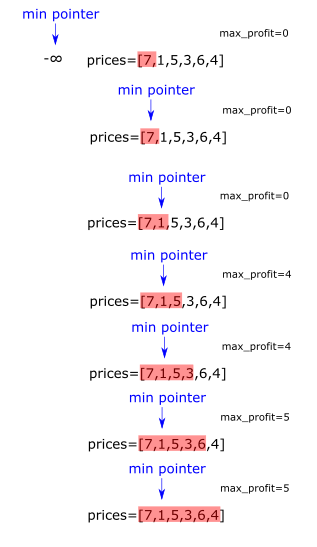

# Approach 1 sliding window
<!-- Describe your approach to solving the problem. -->
sliding window类型题目做的第一题, 实际上sliding window就是two pointer的一个变种，如何巧妙的运用pointer来让one-pass traversal来获取multi-pass traversal一样的信息(做到同样的事情)

## Intuition
<!-- Describe your first thoughts on how to solve this problem. -->



## Algorithm

- 先设置一个pointer指向目前array中的最小值，同时设置一个max_profit variable来储存最大收益值
- traverse the array一遍, 按以下order做事情:
  - 如果有更低的价格, pointer指向那个值, 下一个iteration
  - 如果没有更低的价格，但计算current day price - min value的值超过max_profit, update max_profit
  - 都不满足，do nothing, 下一个ieration


## Complexity
- Time complexity: $O(n)$ one pass solution
<!-- Add your time complexity here, e.g. $$O(n)$$ -->

- Space complexity: $O(1)$
<!-- Add your space complexity here, e.g. $$O(n)$$ -->

## Code
```python
class Solution:
    def maxProfit(self, prices: List[int]) -> int:
        # sliding window approach O(n) in time, O(1) in space
        
        # two pointer 
        min_price = float('inf')
        max_difference = 0

        # not gonna buy on last day
        for i in range(len(prices)):
            if prices[i] < min_price:
                min_price = prices[i]
            elif prices[i] - min_price > max_difference:
                max_difference = prices[i] - min_price
        
        return max_difference
```