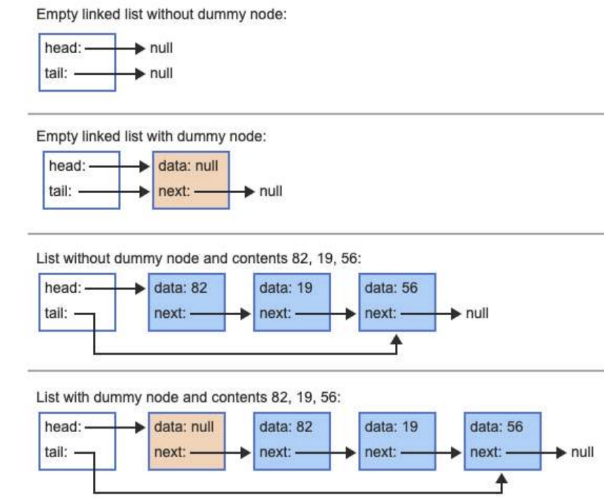

# Readme
---

I implement the singly linked list following the textbook by Prof Kenneth and codebasics. The code is in the hyperlink here [SLinkedList class](SLinkedList.py).


## Problem 1 (from codebasics youtuber)
Implement two more methods in the singly linked list class that does the following:
```python
def insert_after_value(self, data_after, data_to_insert):
    # Search for first occurance of data_after value in linked list
    # Now insert data_to_insert after data_after node

def remove_by_value(self, data):
    # Remove first node that contains data
```
Then make the following calls
```python
 ll = LinkedList()
    ll.insert_values(["banana","mango","grapes","orange"])
    ll.print()
    ll.insert_after_value("mango","apple") # insert apple after mango
    ll.print()
    ll.remove_by_value("orange") # remove orange from linked list
    ll.print()
    ll.remove_by_value("figs")
    ll.print()
    ll.remove_by_value("banana")
    ll.remove_by_value("mango")
    ll.remove_by_value("apple")
    ll.remove_by_value("grapes")
    ll.print()
```
to check the result


## Problem 2 (from codebasics youtuber)
Implement doubly linked list. The only difference with singly linked list is that double linked has prev node reference as well. That way you can iterate in forward and backward direction. Your node class will look this this
```python
class Node:
    def __init__(self, data=None, next=None, prev=None):
        self.data = data
        self.next = next
        self.prev = prev
```
Add following new methods,
```python
def print_forward(self):
    # This method prints list in forward direction. Use node.next

def print_backward(self):
    # Print linked list in reverse direction. Use node.prev for this.
```
Implement all ohter methods like the singly linked list class and make necessary changes for doubly linked list you need to populate node.prev in all those methods).


## Problem 3
In Kenneth A. Lamber's textbook, he mentions the it's a good practice to use a `dummy header node` and `circular linked list`. These two has separate perks.



After asking my friend jerry, he lists the application of dummy header node:
- it is a code hack and is commonly used when you want to avoid writing addtional code for edge cases. often encountered in problem like merge sort linked list.
- it won't improve in terms of performance (time complexity)

In problem 3, you are asked to implement a `singly linked list` class with a dummy header node.

For more details, please refer [here](https://www.studocu.com/en-us/document/de-anza-college/data-abstraction-and-structures/614-linked-list-dummy-nodes/14758369)
> Revise your code so that you don't return the dummy header node as output.

