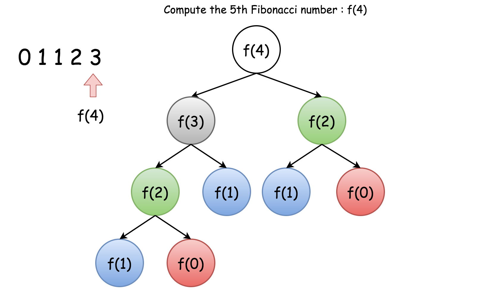

# Recursion (递归)

## 递归的定义

> 递归是一种解决问题的思想，并不是一种具体的算法或者数据结构。它是一种将问题分解为更小的子问题来解决的方法。

## 递归的应用

递归作为一种思想，通常比较难想到和couter-intuitive, 但代码非常简洁。递归往往作为其他算法的基础，比如graph + tree traversal, 但也有应用的，比如:

- file system traversal, 你想recursive列出当前目录的所有`.txt`文件, `ls -R | grep '.txt'`. 当然，你一般是写file parser的，写递归会很简单, 也可以用`os.walk()` if you python.
- used in merge sort

## 递归的特点

!!! warning "思考题"
    给一个正整数n, 输出从1到n的所有整数的和。用iteration和高斯公式很简单，但你能用递归来解决这个问题吗？

??? warning "思考题答案"
    我们可以将求`sum(n)`问题分解为其子问题利用公式, `sum(n) = sum(n-1) + n`：
    
    - 1到n-1的所有整数的和 `sum(n-1)` (子问题)
    - n (已经知道)

    于是我们可以得到递归的定义得到, 

    - **base case**: `sum(1) = 1`
    - **recursive case**: `sum(n) = sum(n-1) + n`
    
    ```python
    def sum(n):
        if n == 1:
            return 1
        return sum(n-1) + n
    ```

## Memoization (记忆化搜索)

> 递归的inefficiency，它会重复计算一些子问题。这种情况下，我们可以使用memoization来避免重复计算。

如下图所示，recursion就像狗熊吃玉米，吃一个掉一个，之前算过的结果用完就丢了，还得再算一次。我们可以用memoization来避免这种情况。



## Complexity

space complexity has recursion-related or non-recursion-related.

## Summary


## 相关题目

- [70 climbing stairs](https://leetcode.com/problems/climbing-stairs/description/) and solution.
- [509 Fibonacci number](https://leetcode.com/problems/fibonacci-number/description/) and solution.
- [206 Reverse Linked List](https://leetcode.com/problems/reverse-linked-list/description/) and solution.


## Reference

- [3blue1brown on recursion](https://www.youtube.com/watch?v=ngCos392W4w&ab_channel=Reducible)
    - visualization and 5-step method
- [tail recursion](https://www.youtube.com/watch?v=_JtPhF8MshA&t=347s&ab_channel=Computerphile)
    
  