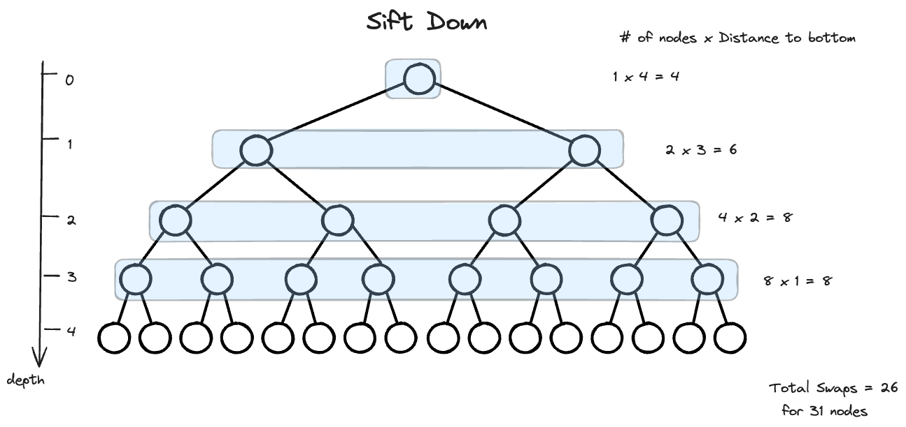

# Heapify is Linear?

It always bugs me why **heapify** or build heap is `O(n)` but **heap sort** is `O(nlogn)`. Look at the following python heapq API, 


## Sift Up and Sift Down

先来介绍一下heap的基本操作，sift up and sift down.这两个operation是heap里做任何操作的基础，用于实现insertion and deletion while maintaining the heap property and complete binary tree property.

Remember, min heap有两个property, complete binary tree and heap property. 这也就意味着, 当你插入的时候，必然是从上至下，从左至右的插入. 插入之后的newly inserted node, 要慢慢的往上浮，直到满足heap property. 这个过程叫做`sift up`, 你sift up的过程，是和自己parent比大小，如果比parent小，就和parent swap to maintain the heap property. 这个过程是`O(logn)`.

Sift down is the opposite of sift up. 当你删除一个node的时候，你要把最后一个node放到root的位置，然后慢慢的往下沉，直到满足heap property. 这个过程是`O(logn)`. 有些许不同的是，你永远有两个child, 只要parent比`min(child1, child2)`要小，就往更小的那个children swap.

So, we summarize what we have so far

|operation|sift up|sift down|
|---|---|---|
|Insertion|$O\log(n)$|N/A|
|Deletion|N/A|$O\log(n)$|

## Heapify with Sift Up and Sift Down

有两种方法实现heapify, 

- `sift up` method: 将所有nodes都来一遍sift up. 这个方法是`O(nlogn)`.
- `sift down` method: 从最后一个node的parent开始，把所有的non-leaf nodes, 都来一遍sift down. 这个方法是`O(n)`.

原因是，leaf nodes由于没有children nodes, 所以自动满足heap property. 根据这一特点，sift down is cheaper.

!!! tip "一语惊醒梦中人"
    root only has 1 node but bottom layer (leaf nodes) has half of the nodes. It makes sense to sift down since we are checking half of what we would have to check if we sift up.

我们来看图, for sift up, 我们把所有的non-root nodes都来一遍sift up, 这个过程是`O(nlogn)`. 


sift up中每一层的操作数量都满足，当前层的nodes数量和到root的距离的乘积. For a heap of size 31, 总计98次操作.

再来看看sift down, 将所有的non-leaf nodes都来一遍sift down, 这个过程是`O(n)`.



sift down中，每一层的操作数量都满足，当前层的nodes数量和到bottom的距离的乘积. For a heap of size 31, 总计26次操作.

那为什么会有这么大的差别呢？主要由于这点:

> **heap is more dense at bottom**: 由于heap是complete binary tree, 所以bottom layer的nodes数量是最多的, 如果定义一个密度$\rho$, 越往下的密度越高. 由于底部密度高，造就了leaf nodes的数量是non-leaf nodes的两倍.

这导致了越下面的nodes,不仅数量多，而且距离root的距离也更远，但距离leaf nodes的距离却是更近的. 让我们来定义一个$\bar{d}$ 代表着每一个nodes所需要swap的平均距离。所以说sift down占尽了天时地利人和:

- 从数量上来说，sift down只需要处理一半的nodes.
- 从距离上来说，sift down中，
    - 更多nodes所在的底层，只需要走到leaf nodes，平均下来每个nodes要走的距离还小.
    - 较少nodes所在的上层, 稍微苦一点，走到底部距离较远，但是数量少，所以总体来说，还不错

sift down算是比较友善的结构，大多数人吃点小苦，少数人吃大苦, $\bar{d}_{siftdown}$ 比较小。再来看看sift up

- 从数量上来说，sift up需要处理所有的nodes - 1. 只有root node不需要处理.
- 从距离上来说，sift up中，
    - 更多的nodes所在的底层，需要走到root, 距离较远. 怎么说，我不仅数量多，我走的还远
    - 较少的nodes所在的上层，走到root距离较近，但是数量少，所以总体来说，还不错

sift up就不一样了，大多数人吃大苦，少数人吃点小苦。 $\bar{d}_{siftup}$ 比较大, 不合理。

综合比较一下，summarize it here

|-|# of nodes for operation|$\bar{d}$|
|-|-|-|
|sift up|$n-1$|每个nodes要走的平均距离较大|
|sift down|$\approx \frac{n}{2}$|每个nodes要走的平均距离较小|

综上所述，sift down 不仅数量上更友好，而且每个node要走的距离上也更友好，所以heapify with sift down is `O(n)`.


## Mathematical Proof


### Sift Down
我们intuitively understand why sift down is faster than sift up. 但是我们还是需要一个数学证明来证明这一点. 先来看看sift down的那张图，我们把方程右边的部分累加在一起找规律,
```
# distance to bottom x number of nodes (from bottom to top)
(1 * 8) + (2 * 4) + (3 * 2) + (4 * 1) = 26
```
假设总计有$n$个nodes, 再generalize一下，考虑bottom layer
```
(0 * n/2) + (1 * n/4) + (2 * n/8) + ... + (h * 1) = n
```
where $h = \log_2(n)$.

We generalize the above equation into a more compact series, 

$$
\begin{align}
1 \cdot \frac{1}{4} + 2 \cdot \frac{1}{8} + 3 \cdot \frac{1}{16} + ... + h \cdot 1 &= \sum_{k=1}^{h} \frac{kn}{2^{k+1}} \\
&= \frac{n}{4}\sum_{k=1}^{h} \frac{k}{2^{k-1}} < \frac{n}{4}\sum_{k=1}^{\infty} \frac{k}{2^{k-1}}\\
\end{align}
$$

And then, 我们提取导数符号后，得到无限级数的部分，

$$
\begin{align}
\frac{n}{4}\sum_{k=1}^{\infty} \frac{k}{2^{k-1}} &= \frac{n}{4}\sum_{k=1}^{\infty}kx^{k-1}\quad x = \frac{1}{2} \\
&= \frac{n}{4}\frac{d}{dx}\sum_{k=1}^{\infty}x^k \\
&= \frac{n}{4}\frac{d}{dx}\left(\frac{x}{1-x}\right) \\
&= \frac{n}{4}\frac{1}{(1-x)^2} \\
&= \frac{n}{4}\frac{1}{(1-\frac{1}{2})^2} \\
&= n\\
\end{align}
$$

## Summary

这一章我们，

- 介绍了sift up and sift down in heap
- 比较了sift up and sift down的在heapify的时间复杂度
- 用数学证明了sift down的时间复杂度是`O(n)`

## Reference

- [Heap Visualization at 19:40](https://www.youtube.com/watch?v=Dvq-YKeuO9Y&ab_channel=BlueTreeCode)
- [Stackoverflow: why build heap is O(n) but heapify and heap sort is O(nlogn)](https://stackoverflow.com/questions/9755721/how-can-building-a-heap-be-on-time-complexity)

