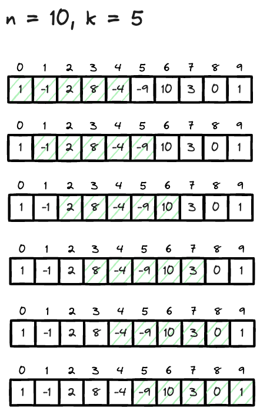

# Monotonic Queue (单调队列)

## 为什么需要单调队列?

在理解单调队列之前，先看看它解决了什么问题

??? note "[Sliding Window](https://leetcode.com/problems/sliding-window-maximum/description/)"
    Given an array of length `n`, find the maximum value of each subarray of length `k`.

你把图画出来，n = 10, k = 5, 你会发现这是一个滑动窗口问题。



brute force solution比较容易想到，建立一个大小为k的窗口，每次移动一格，然后找到窗口内的最大值。这样的时间复杂度是$O(nk)$. 你发现有大量的overlap的计算，但你会发现，实际上，每次移动窗口，只有一个元素进入窗口，一个元素离开窗口, 因此可以利用这个逻辑来优化算法, 使时间复杂度降到$O(n)$，这就是单调队列的思想。

??? warning 
    只比较window内最大值与新进入和离开的元素是不足够的，假设你window中最大值为10，但你有两个10. window中第二大的值为7，incoming value为9, outgoing value为10. 如
    
    ```
    nums = [10,10,7,4,9,1], k = 4

    first_window = [10,10,7,4]
    incoming_value = 9
    outgoing_value = 10
    ```
    你需要非常多的额外的逻辑来处理这种情况，且很难generalize. 而单调队列可以很好的处理这种情况。

## Definition

单调队列顾名思义,

- `单调`: 指的是栈内元素的单调性. 可增可减.
- `队列`: 指的是栈内元素只能enqueue和dequeue.也就是operation on both ends.

### 单调队列的implementation

Maintain a monotonic queue, 最重要的是维持其单调性, 比如维护一个单调递增的队列,具体逻辑是

- `case 1`: 新元素比所有元素大，直接入队
- `case 2`: 新元素比部分元素大, pop队列中比它大的元素，入队
- `case 3`: 新元素比所有元素小，清空队列，入队

其中case 3是case 2的特例, 所以可以归入一起. 同理，上述维护单调递增的逻辑和单调递减逻辑相同。那么接下来我们来看implementation, 

#### 单调递增队列

```python
def monotonic_increasing(nums):
    """
    monotonically increasing queue

    :param _type_ nums: _description_
    """
    queue = deque()
    n = len(nums)
    print("monotonically increasing queue:")
    print("*" * 40)
    for i in range(n):
        # 把小的往左塞
        while queue and nums[i] <= queue[-1]:
            queue.pop()
        queue.append(nums[i])
        print(f"{i}: {queue}")
    print("\n")

```

假设我们的输入为`nums = [1,3,-1,-3,5,3,6,7]`, 我们来看看单调递增队列的变化.

```
monotonically increasing queue:
****************************************
0: deque([1])
1: deque([1, 3])
2: deque([-1])
3: deque([-3])
4: deque([-3, 5])
5: deque([-3, 3])
6: deque([-3, 3, 6])
7: deque([-3, 3, 6, 7])
```

#### 单调递减队列

```python
def monotonic_decreasing(nums):
    """
    monotonically decreasing queue

    :param _type_ nums: _description_
    """
    queue = deque()
    n = len(nums)
    print("monotonically decreasing queue:")
    print("*" * 40)
    for i in range(n):
        # 把大的往左塞
        while queue and nums[i] >= queue[-1]:
            queue.pop()
        queue.append(nums[i])
        print(f"{i}: {queue}")
    print("\n")
```
同理，我们来看看单调递减队列的变化.

```
monotonically decreasing queue:
****************************************
0: deque([1])
1: deque([3])
2: deque([3, -1])
3: deque([3, -1, -3])
4: deque([5])
5: deque([5, 3])
6: deque([6])
7: deque([7])
```

### Summary

所以，我们可以总结出以下几点, 

- `单调递增队列:` 维护的是递增性和最小值, `单调递减队列:` 维护的是递减性和最大值
- 在`enqueue`之前，我们需要`dequeue`一些元素，以维持单调性 (case 2 + case 3), 最坏情况全部`dequeue`

## Sliding Window的限制条件

我们上述只维护了monotonic queue, 但这类数据结构的应用，往往牵扯到sliding window的问题，所以我们需要在维护单调行之外，还需要维护sliding window的限制条件，比如

- `window size`: 窗口大小, 也就是你的monotonic queue不能大于window size k
- `monotonic queue`里没有除了window窗口里以为的数. 

第一个很好理解和实现，第二个看似trivial, 但实际上需要一些额外的补充逻辑来实现. 最简单的处理方法是maintain index instead of value in the queue. 

### Sliding Window例子

假设我们有这一道题目，让你将每个窗口的最大值找出来，然后组合成一个数组返回.

```
Input: nums = [1,3,-1,-3,5,3,6,7], k = 3
Window position                Max          window
---------------               -----         -----
[1  3  -1] -3  5  3  6  7       3             1
 1 [3  -1  -3] 5  3  6  7       3             2
 1  3 [-1  -3  5] 3  6  7       5             3
 1  3  -1 [-3  5  3] 6  7       5             4
 1  3  -1  -3 [5  3  6] 7       6             5
 1  3  -1  -3  5 [3  6  7]      7             6
```

假设我们对上述例子维护一个单调递增的monotonic queue with the constraints of window size `k==3`, dry run 如下,

|当前window| 操作                              | with window队列状态      | w/o window队列状态 |
|-| ------------------------------- | --------- | -|
|1| 1 入队                            | `{1}`     |`{1}`     |  
|1| 3 比 1 大，3 入队                    | `{1 3}`   | `{1 3}`     | 
|1| -1 比队列中所有元素小，所以清空队列 -1 入队       | `{-1}`    | `{-1}`     | 
|2| -3 比队列中所有元素小，所以清空队列 -3 入队       | `{-3}`    | `{-3}`     | 
|3| 5 比 -3 大，直接入队                   | `{-3 5}`  | `{-3 5}`     | 
|4| 3 比 5 小，5 出队，3 入队               | `{-3 3}`  | `{-3 3}`     | 
|5| -3 已经在窗体外，所以 -3 出队；6 比 3 大，6 入队 | `{3 6}`   | `{-3 3 6}`     | 
|6| 7 比 6 大，7 入队                    | `{3 6 7}` | `{-3 3 6 7}`     | 

现在我们知道维护window size的monotonic queue了, 但具体落实到代码里，我们需要回答的问题是, 怎么判断我们


## 相关题目

Credit to this [post](https://leetcode.com/problems/shortest-subarray-with-sum-at-least-k/solutions/204290/Monotonic-Queue-Summary/)

- LC 84. Largest Rectangle in Histogram
- [LC 239. Sliding Window Maximum](https://leetcode.com/problems/sliding-window-maximum/) and [solution](../../leetcode/239-sliding-window-maximum/index.md).
- LC 862. Shortest Subarray with Sum at Least K
- LC 901. Online Stock Span
- LC 907. Sum of Subarray Minimums

## Reference
