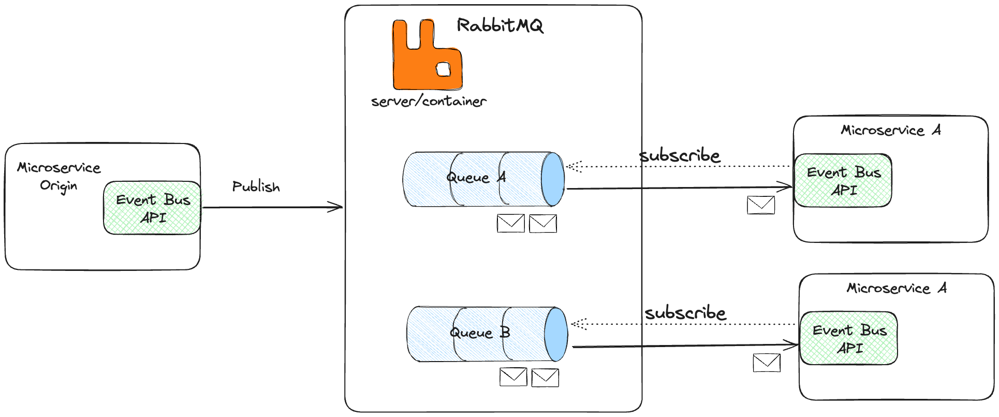
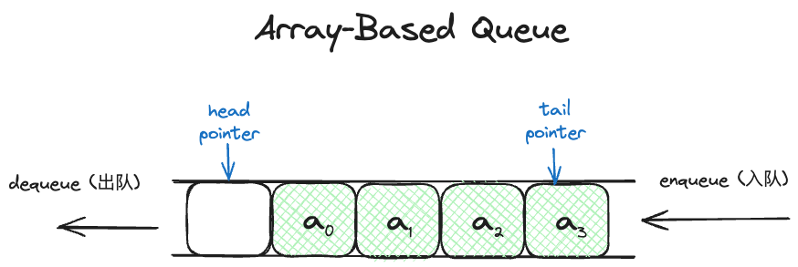
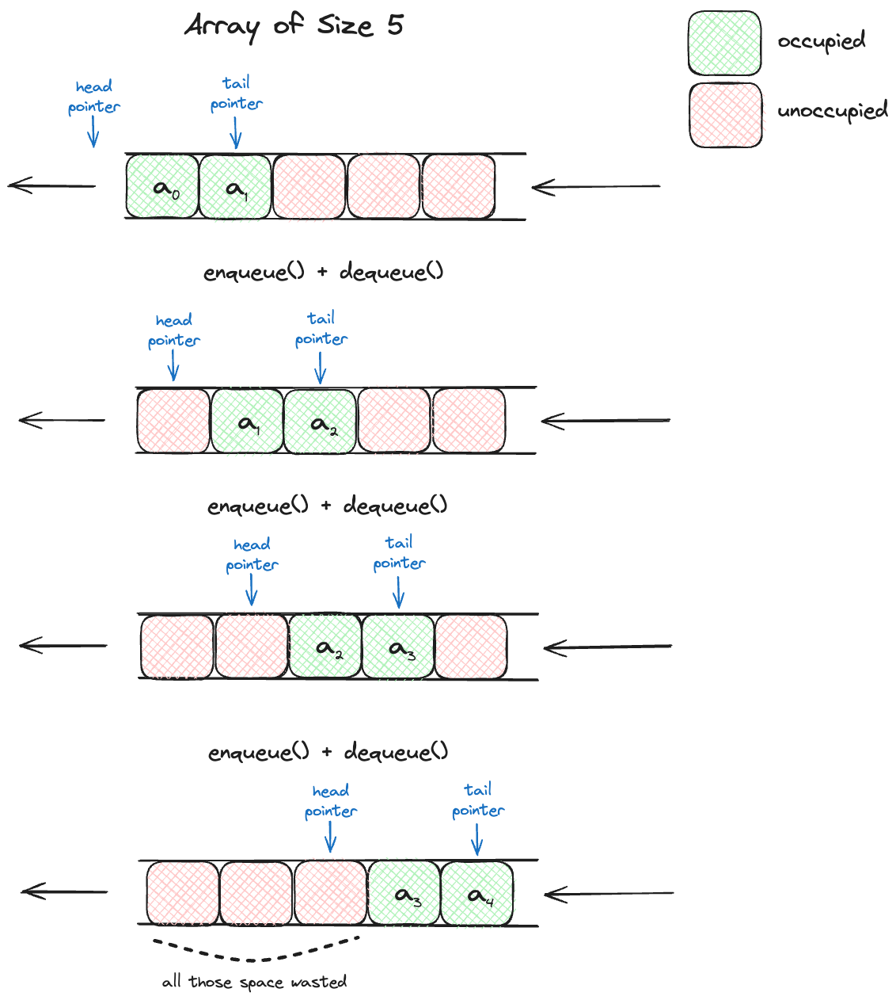

# Queue


## Queue的定义

> *Queue (队列)*: 一种线性表数据结构，只允许在表的一端进行插入，而在另一端进行删除. 这种数据结构遵循FIFO (First In First Out)的原则. 也就是说，先进入队列的元素，先被删除. 


你可以直接理解成排队，先来的先服务. 你去银行排队，先来的人先办业务，后来的人后办业务. 这就是queue的特性.

??? warning "为啥我画成右进左出?"
    绝大多数文明的人，都适用于从左往右阅读。但为什么我queue画成反人类的右进左出吗? 

Unlike stack, 只允许一个端口执行增加和删除操作, queue有两个端口，一个专门用来增加元素，另一个用来删除元素. 

- `dequeue()`: remove an element from the head of the queue
- `enqueue()`: add an element to the tail of the queue

## Queue的应用

Microservices, 一个很流行的架构模式, 用来解耦和scale application.中间需要一个消息传递的系统, 这时候就需要中间件. 比较火的中间件[RabbitMQ](https://www.rabbitmq.com/docs/documentation), 就是一个distributed message queue, 用来做消息的传递. 先来的任务先处理, 这就是queue的特性, FIFO (first in first out).




## Queue的实现

Queue作为一种linear data structure, 一般分为顺序储存和链式储存两种方式. 顺序储存一般用数组实现，链式储存一般用链表实现.

```mermaid
graph TD
    A[Queue]
    
    subgraph "顺序储存"
    B[Array-based Queue]
    C[Circular Array-based Queue]        
    end

    subgraph "链式储存"
    D[Linked List-based Queue] 
    end
    
    A --> B & C & D
```

那么先来看看需要实现queue的哪些功能:

- `init()`: 初始化queue, 有一个capacity.
- `is_empty()`: 判断queue是否为空
- `is_full()`: 判断queue是否满了
- `enqueue()`: 将元素加入queue
- `dequeue()`: 将元素从queue中删除
- `head_value()`: 查看queue的头元素, 也就是即将被dequeue的元素.
- `tail_value()`: 查看queue的尾元素, 也就是最后一个被enqueue的元素.

由于需要实现支持两头的操作，unlike stack using only 1 pointer `top`, queue就需要维护两个pointer `head` and `tail`. 开销稍微大一点.

### 方法1: Array-based Queue

> *Array-based Queue*: 使用数组进行实现，在python中list可以很好的实现. 

Array是一段连续的memory, 但只有在`head` and `tail` pointer中间的部分，`[head+1,tail]` 才是queue的有效部分.



具体implementation如下:

```python
class Queue:
    # 初始化空队列
    def __init__(self, size=100):
        self.size = size
        self.queue = [None for _ in range(size)]
        self.head = -1
        self.tail = -1
        
    # 判断队列是否为空
    def is_empty(self):
        return self.head == self.tail
    
    # 判断队列是否已满
    def is_full(self):
        return self.tail + 1 == self.size
    
    # 入队操作
    def enqueue(self, value):
        if self.is_full():
            raise Exception('Queue is full')
        else:
            self.tail += 1
            self.queue[self.tail] = value
            
    # 出队操作
    def dequeue(self):
        if self.is_empty():
            raise Exception('Queue is empty')
        else:
            self.head += 1
            return self.queue[self.head]
        
    # 获取队头元素
    def head_value(self):
        if self.is_empty():
            raise Exception('Queue is empty')
        else:
            return self.queue[self.head + 1]
    
    # 获取队尾元素
    def tail_value(self):
        if self.is_empty():
            raise Exception('Queue is empty')
        else:
            return self.queue[self.tail]
```

`Array-based Queue`会造成什么问题呢? 如果你array size为5，你做以下的操作:

- `enqueue()` 2次
- `enqueue()` 1次, `dequeue()` 1次. 这样repeat 5次

你会发现你的`tail` pointer已经到了静态array的size limit, 也就是`tail = 4` (0-indexed). 如下图所示， 



这时候你有两个选择:

- `shift array`: 将整个array向左移动一位, 这样你就可以继续`enqueue()`了. 
- `动态扩容`: 创建一个新的array, 大小是原来的两倍, 然后将原来的array copy到新的array中, 然后destroy老的array.

你如果使用方案1，worst case scenario, 虽然你array还有空间，但是每次`enqueue()`都要做两次操作. 你如果使用方案2，那么你原来的空间不就浪费了吗? 这两种方法都不是很好. 所以总结一下，`Array-based Queue`的缺点就是:

- 有一定概率会造成空间浪费

那么我们有什么办法物尽其用嘛??

### 方法2 Circular Array-based Queue

> *Circular Array-based Queue*: 为了解决`Array-based Queue`的空间浪费问题，利用双指针进来wrap around, 来manipulate array从而不至于浪费空间. 

??? note "[LC 622. Design Circular Queue](https://leetcode.com/problems/design-circular-queue/description/)"
    这题就是考的这种实现方法.


- `Linked List-based Queue`: 略
- `two stack emulation`: 用俩stack, 颠来倒去, 一个stack用来push, 一个stack用来pop, 这样就可以实现queue的FIFO特性了. 想象成一个spring coil or [tower of Hanoi](https://en.wikipedia.org/wiki/Tower_of_Hanoi). 这题可以看这里.
    - [LC 232. Implement Queue using Stacks](https://leetcode.com/problems/implement-queue-using-stacks/description/)


这三种方式的复杂度如下表:

| Operation | Array-based Queue | Linked List-based Queue | Two Stack Emulation |
| --------- | ------------------ | ------------------------ | ------------------- |
| Enqueue   | O(1)               | O(1)                     | O(1)                |
| Dequeue   | O(n)               | O(1)                     | O(n)                |
| Peek      | O(1)               | O(1)                     | O(n)                |


先来看看构建这个queue, 我们需要:

- `self.queue`: 一个array, 用来存储queue的element
- `self.count`: 一个counter, 用来记录queue的element个数
- `self.capacity`: 一个int, 用来记录queue的最大容量
- `self.head`: 一个int, 永远指向queue的first element in the queue.

当有了这些关系，我们可以推算出tail pointer的位置

- `tail = (head + count - 1) % capacity`: 指向first available empty slot ready to be enqueued
- `tail_enqueue = (head + count - 1) % capacity`: 指向the last element in the queue (刚刚enqueue进来的).

`tail` points to the last item in the queue, 也就是刚刚enqueue进来的element. `tail_enqueue` points to the last available slot ready to be enqueued, 也就是"可以允许被覆盖的位置".

!!! tip Tip
    里面的`%`是取余数的意思, 也就是说，当我们的head在一端时，我们可以wrap around到另一端，这样就实现了circular queue的特性. 任何circular的特性，都可以解.

看下图来理解wrap around和two pointers technique, 


你从这里可以看到, 

```python
class MyCircularQueue:
    """
    Use array to implement "circular "queue. Imagine we have a full queue like 
    [1, 2, 3, 4 ,5 ]
    and we execute two dequeue() from the top. 
    [_, _, 3, 4 ,5 ]
    Now, we have some space near the head but we don't have space at the tail. 
    It will cause problem if we decide to enqueue(i), we will be
    - shifting everything to fill the empty space near head of the queue (O(n))
    - expand the fix-sized array, (create an array of size 2n, move to it, destroy the old array)
    """
    def __init__(self, k: int):
        self.queue = [0 for _ in range(k)]
        self.count = 0
        self.capacity = k
        # always points to the head of the queue
        self.head = 0
        
    def enQueue(self, value: int) -> bool:
        """
        Insert an element into the circular queue from tail. Return true if the operation
        is successful. Return false if the queue is maxed out.
        """
        if self.count == self.capacity:
            return False
        # last available slot ready to be enqueued
        tail_enqueue = (self.head + self.count) % self.capacity
        self.queue[tail_enqueue] = value
        self.count += 1
        return True

    def deQueue(self) -> bool:
        """
        Pop an element from the head. Return true if the operation is successful.
        Return false if the queue is empty
        """
        if self.count == 0:
            return False
        # remove the element at head
        self.head = (self.head + 1) % self.capacity
        self.count -= 1
        return True
        

    def Front(self) -> int:
        if self.count == 0:
            return -1
        return self.queue[self.head]
        

    def Rear(self) -> int:
        if self.count == 0:
            return -1
        # points to last item in the queue (who just enqueued)
        tail = (self.head + self.count - 1) % self.capacity
        return self.queue[tail]
        
    def isEmpty(self) -> bool:
        return self.count == 0

    def isFull(self) -> bool:
        return self.count == self.capacity
```

### 方法3: Linked List-based Queue


## Reference

