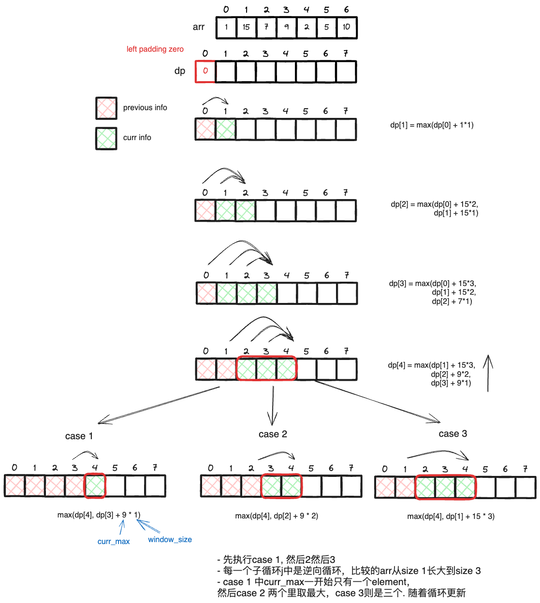

# 1043 Partition Array for Maximum Sum

## Approach 1 Memoization

memoization solution, 其实更值得学习。不仅memo是dp的基础，两个是transferable的，而且这个分解子问题的tree problem思想，可以覆盖到很多题型.

```python

```


## Approach 2 Bottom Up DP

Dp最难的地方在于，根据你的

- state definition
- initial condition
- state transition function
  
会在iterator, + i, + j - i + 1等各个方面给你很多troubles. 所以我们这一题会尝试, 

- 正向,逆向iterate
- 不同dp state定义


### Approach 2.1 

If you look at the example, 


```
Input: arr = [1,15,7,9,2,5,10], k = 3
Output: 84
Explanation: arr becomes [15,15,15,9,10,10,10]
```

通过这个例子，我们可以有,
```python
dp[0] = 0
dp[1] = max(dp[0] + 1*1)  # 2 <-
dp[2] = max(dp[0] + 15*2, # 30 <-
            dp[1] + 15*1) # 17
dp[3] = max(dp[0] + 15*3, # 45 <-
            dp[1] + 15*2, # 32 
            dp[2] + 7*1)  # 37
# alway has max 3 sub problem to compare          
dp[4] = max(dp[1] + 15*3, # 47
            dp[2] + 9*2,  # 48
            dp[3] + 9*1)  # 54 <-
```

看以下图解, 
- `dp[i]:` 
  - 代表前i个数的复合条件的最大和
- `initial condition:` 
  - `dp[0] = 0`, 也就是前0个数的最大和是0, arr为空集.
  - 这个技巧叫做left padding, 主要是为了方便运算
- `state transition function:`
  - `dp[i] = max(dp[i-k] + max(arr[i-k+1, i]) * k) for 1 <= k <= min(i,k) `





```python
class Solution:
    def maxSumAfterPartitioning(self, arr: List[int], k: int) -> int:
        dp = [0 for _ in range(len(arr)+1)]
        dp[0] = 0

        for i in range(1,len(arr)+1):
            curr_max = -1
            for j in range(1,min(i,k)+1):
                curr_max = max(curr_max,arr[i-j])
                dp[i] = max(dp[i],dp[i-j] + j * curr_max)
        
        return dp[-1]
```

## Reference

- [huahua](https://www.youtube.com/watch?v=3M8q-wB2tmw&t=606s&ab_channel=HuaHua)

