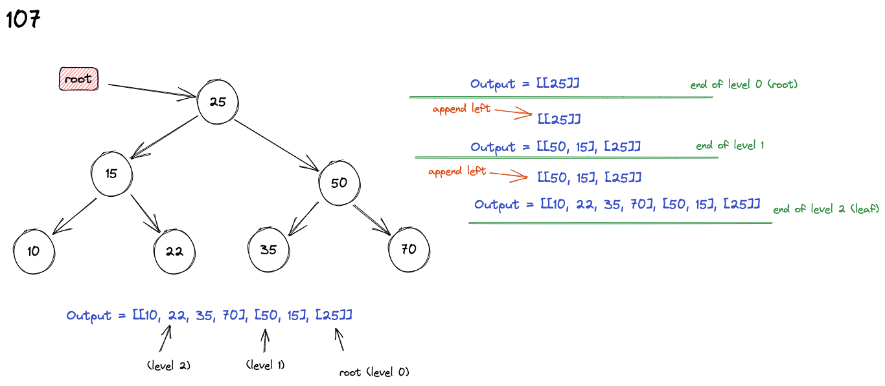

# Problem
Given the `root` of a binary tree, return the bottom-up level order traversal of its nodes' values. (i.e., from left to right, level by level from leaf to root).

Example 1: 

```python
    3
   / \
  9   20
     /  \
    15   7
```

expected output
```
[
    [15,7],
    [9,20],
    [3]
]
```

# Algorithm

We have two way to solve it:
- solve it as regular BFS then we reverse the output by `res[::-1]` or `res.reverse()`
- we use another deque for our `res` to do that

As illustrated in the figure below





# Code

```python
# Definition for a binary tree node.
# class TreeNode:
#     def __init__(self, val=0, left=None, right=None):
#         self.val = val
#         self.left = left
#         self.right = right
from collections import deque
class Solution:
    def levelOrderBottom(self, root: Optional[TreeNode]) -> List[List[int]]:
        # edge case
        if root is None: return []

        # BFS then reverse
        levels = deque()
        queue = deque([root])

        while queue:
            curr_level = []

            for _ in range(len(queue)):
                # pop and append 
                curr = queue.popleft()
                curr_level.append(curr.val)

                if curr.left: queue.append(curr.left)
                if curr.right: queue.append(curr.right)

            # append to the left
            levels.appendleft(curr_level)

        return levels
            
        
```
