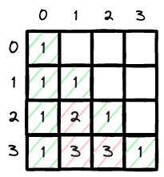

---
tags:
  - Array
  - Dynamic Programming
---

# [119 Pascal's triangle II](https://leetcode.com/problems/pascals-triangle-ii/description/)

Pascal triangle is a triangle where all numbers are the sum of the two numbers above it. 

```
              h
    1         0
   1 1        1
  1 2 1       2
 1 3 3 1      3
```

其实储存在计算机里，是一个upper triangle为0的矩阵, 如下图,



每一层的数据，都只依赖于上一层的数据.

> **Follow-up**: Could you optimize your algorithm to use only O(rowIndex) extra space?

## Approach 1: DP

之前说过，可以用一个2d array来存储这个triangle, 而且这些数据都存在lower triangle, 那么我们先找特殊情况，什么时候这个array为1?

- 第一列 `j == 0`
- 主对角线 `i == j`
- 第一行 `i == 0`

这就是我们的初始条件。更新条件很简单，只依赖于上一行的信息. 所以我们可以写出状态转移方程:

$$
dp[i][j] = 
\left\{
\begin{array}{ll}
      1 \quad \text{if i = 0 or j = 0 or i == j}\\
      dp[i-1][j-1] + dp[i-1][j] \quad \text{otherwise} \\
\end{array} 
\right.
$$


做一下space optimization, 由于每一行只依赖于上一行，可以创建两个rolling数组，一个`prev`存上一行的，一个`res`存当前行的, 由于update都是从prev to res, 从左到右.

### Code Implementation

```python
class Solution:
    def getRow(self, rowIndex: int) -> List[int]:
        # 0 <= rowIndex <= 33
        # edge cases
        if rowIndex == 0: return [1]
        if rowIndex == 1: return [1,1]

        # initial condition
        prev = [1,1]
        
        # top --> down
        for i in range(2,rowIndex+1):
            res = [None] * (i+1)
            # head
            res[0] = 1
            # left --> right
            for j in range(1,i):
                res[j] = prev[j-1] + prev[j]
            # tail
            res[i] = 1

            # update prev pointer
            prev = res
        
        return res
```

## Approach 2: Recursion

python写这个解法TLE了


```python
class Solution:
    def getRow(self, rowIndex: int) -> List[int]:
        # base case
        res = []
        # 这一行的, iterate over all columns
        for i in range(rowIndex + 1):
            res.append(self.getNum(rowIndex,i))
        return res

    def getNum(self,row,col):
        # triangle的每一行第一个和最后一个都是0
        if row == 0 or col == 0 or row == col:
            return 1
        
        return self.getNum(row-1,col-1) + self.getNum(row-1,col)
```