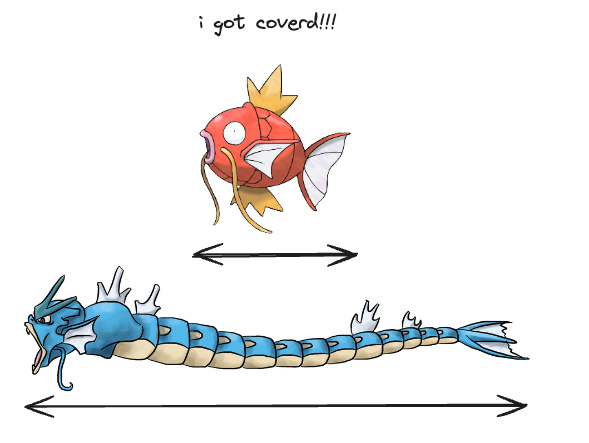

---
tags:
    - Array
    - Sorting
---

# [1288 Remove Covered Intervals](https://leetcode.com/problems/remove-covered-intervals/)

答题思路,

- brute force, O(n^2), traverse all possible pairs of interval
- sort + greedy, O(nlogn)
- sort but space optimized

最优解为$O(n\log n)$ in time, O(1) in space. 这一题存在两个难点,

- 如何决定排序顺序
- 为何只需要比较排序后最近的一个non-overlapping interval?


## Approach 1: Brute Force

略


## Approach 2: Sort + Greedy

想象一下，我们有一堆可能有被cover情况的interval, 我们要移除掉所有被cover的interval, 留下的就是没有被cover的interval. 被cover很好理解，就如下图的暴鲤龙和鲤鱼王,



你要剔除所有的鲤鱼王的情况，就是大鱼吃小鱼。首先，intervals的题目的第一思路是排序，那怎么样排序呢，八种可能性,

- `case 1`: sort by start_time aescendingly, then by end_time aescendingly
- `case 2`: sort by start_time aescendingly, then by end_time descendingly
- sort by start_time descendingly, then by end_time aescendingly (不符合)
- sort by start_time descendingly, then by end_time descendingly (不符合)
- sort by end_time aescendingly, then by start_time aescendingly (不符合)
- sort by end_time aescendingly, then by start_time descendingly (不符合)
- `case 3`: sort by end_time descendingly, then by start_time aescendingly 
- `case 4`: sort by end_time descendingly, then by start_time descendingly 

为什么剩下几个case不符合呢? 因为我们希望能尽可能的把这些鱼拉开. 

- sort first by start_time aescendingly, 可以把鱼的起点拉开，保证前面的鱼都有可能吃掉后面的鱼, 而不会被吃
- soft first by end_time descendingly, 可以把鱼的终点拉开，保证前面的鱼都有可能吃掉后面的鱼, 而不会被吃

如果反一反，sort first by start_time descendingly, 前面的鱼反而存在被吃掉的可能. 当然，我们也可以反着计算，计算被吃掉的鱼的数量`x`, 然后`n - x`得到没被吃的情况。Anyways, 我们先看看我filter后的四种情况

我们要保证的是，第一条鱼是要放入non-overlapping list的，那是一定不会被吃掉的那一条鱼。所以我们为了判断用什么排序，我们先枚举一下四种情况然后试图contradict一下，看看哪种情况是不行的。

Case 1 显然不行，如果第一条鱼和第二条鱼起点相同，又按鱼终点升序，那么第一条鱼一定会被吃掉。

```
case 1 aesc,asec 反例

|----|
|-------|
```

看case 2, 似乎暂时找不到反例。我第一条鱼不仅起点更靠左，我终点还更靠右边。最坏情况是是有许多条duplicate鱼，那也不用担心，因为只有第一条能进来。后面都会被这第一条鱼吃掉

```
case 2 aesc,desc
|-------|
|----|
```

看case 3, 我的第一条鱼，鱼尾巴更靠右，我的终点还更靠左。这也是无敌的大鱼，不会被吃掉的！目测case 2 and 3都可以.

```
case 3 end time desc, start time aesc
  |---------|
    |-------|
|----|
```

看case 4,  我的第一条鱼，鱼尾巴更靠右，我的起点也更靠右，没办法满足我不被吃啊!

```
case 4 desc,desc 反例
    |-------|
  |---------|
|----|
```

综上，我们选择case 2 or case 3都可. 目前选择case 2, sort by start_time aescendingly, then by end_time descendingly.


!!! warning "为什么只关心上一条鱼?"
    上一条鱼是最近的一条大鱼. 再之前的鱼，最多和它有overlap, 不存在互相cover的关系。为什么我们不关心以前的鱼呢? 因为我们case 2的排序方式，已经尽量把大鱼放在前面了(sort by start ascendingly if tie, sort desc), 如果这样还被吃掉, 只有可能是如下的可能
    ```
    |-------|
    |----|
    or
    |-------|
      |----|
    ```
    再往前的, 如果存在一种可能性，第三条鱼不被第二条鱼吃掉，反而被第一条鱼吃掉的话，那就只能是如下图的情况。这种情况是不存在的，因为这样的话，第二条鱼在判定的时候，就会被第一条鱼吃掉。所以这种情况不成立
    ```
    |-------------| 
        |-------|
        |----|
    ```
    绝大多数的情况是这样的,
    ```
    |---------| 
        |-------|
        |----|
    ```
    最近的这条大鱼，左边肯定符合cover条件，因为升序，但这条鱼的右边，肯定满足比前面的鱼更靠右的条件，所以才不会被吃掉，所以last fish is the king of the pond. 这就是为什么贪心能成立，且可以在sort后忽略前面的鱼的比较的情况.

针对case 2 and case 3, 我们进行分类讨论看看代码实现

### Case 2: sort by start_time aescendingly, then by end_time descendingly


!!! note "Solution"
    利用case 2 asec,desc
    ```python
    class Solution:
        def removeCoveredIntervals(self, intervals: List[List[int]]) -> int:
            # 大鱼吃小鱼: 小的interval, 如果被cover掉就会吃掉了，所以剩下的都是大鱼.

            # sort by start_time aescendingly, then by end_time descendingly
            intervals.sort(key=lambda x:(x[0],-x[1]))

            # greedy
            res = [intervals[0]]
            for start,end in intervals[1:]:
                # check last non-covered interval, 很最近的一条大鱼进行比赛
                prev_start,prev_end = res[-1]
                
                if start >= prev_start and end <= prev_end:
                    # covered! we can't do that!!
                    continue            
                res.append([start,end])

            return len(res)
    ```
    Then we can simplify out logic by

    - replace `if start >= prev_start and end <= prev_end:` with `if end <= prev_end:` 我们已经按start_time升序排列了，所以prev_start <= start是恒成立的
    - 我们只关心last element, 最后求的是长度。所以维护一个last element和counter就好了.

    ```python
    class Solution:
    def removeCoveredIntervals(self, intervals: List[List[int]]) -> int:
        # 大鱼吃小鱼: 小的interval, 如果被cover掉就会吃掉了，所以剩下的都是大鱼.

        # sort by start_time aescendingly, then by end_time descendingly
        intervals.sort(key=lambda x:(x[0],-x[1]))

        # greedy
        last = intervals[0]
        counter = 1
        for start,end in intervals[1:]:
            # check last non-covered interval, 很最近的一条大鱼进行比赛
            prev_start,prev_end = last
            
            if end <= prev_end:
                # covered! we can't do that!!
                continue            
            # now, i am the new king!
            last = [start,end]
            counter += 1

        return counter
    ```

### Case 3: sort by end_time descendingly, then by start_time aescendingly

同理，剩下的几个case代码如下

!!! note "case 3"
    ```python
    class Solution:
    def removeCoveredIntervals(self, intervals: List[List[int]]) -> int:        
        intervals.sort(key=lambda x:(-x[1],x[0]))

        # greedy
        res = [intervals[0]]
        for start,end in intervals[1:]:
            # check last non-covered interval, 很最近的一条大鱼进行比赛
            prev_start,prev_end = res[-1]
            
            if start >= prev_start:
                # covered! we can't do that!!
                continue            
            res.append([start,end])

        return len(res)
    ```


## Approach 3: 计算被covered的interval数量

conjugate即可，i.e. 计算不被cover的interval数量，然后用`n - x`即可。