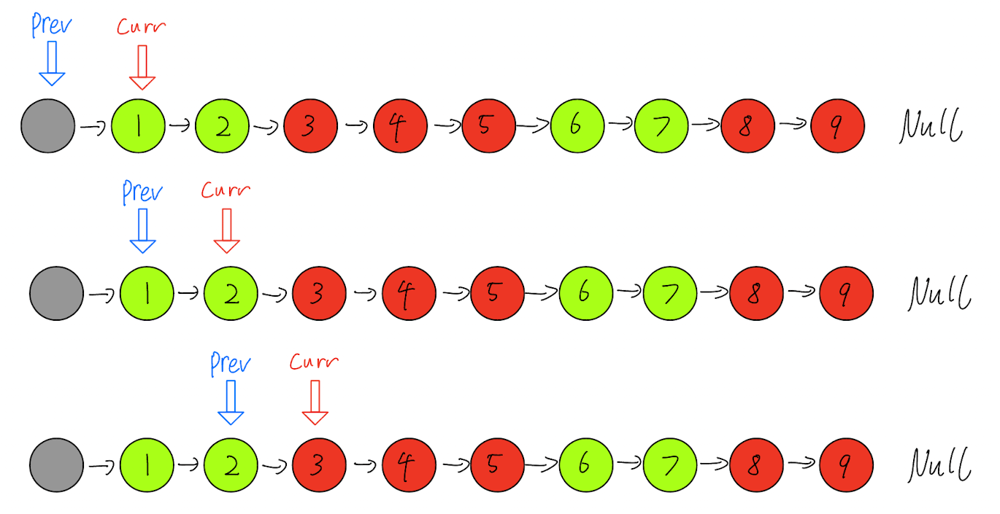
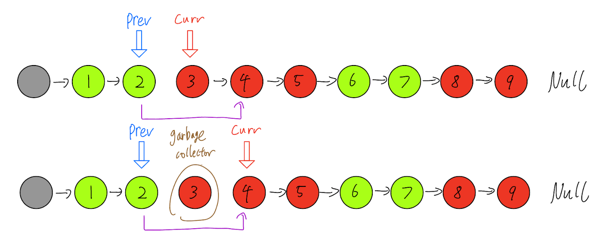

# Intuition
<!-- Describe your first thoughts on how to solve this problem. -->
When i see linked list:
- set up a dummy header node
- set two pointers for helping traversal, one points to current node, one points to previous node shown in the figure below


# Approach
<!-- Describe your approach to solving the problem. -->
- declare a dummy node and insert at the begining of the linked list `head`
- create two pointer `prev` and `curr` refers to the previous node and current node, initialize `prev` and `curr` with `dummy_node` and `head`, respectively
-  traverse until the end with `while` statement
    - `for loop` of fixed `m` steps, just shuffles both pointers. `else` for cases when it reaches the end of linked list and return `dummy_node.next` (for skipping dummy node).
    - `for loop` of fixed `n` steps, remove the current node and shuffle `curr` pointer forward since `prev` stays at the same location. `else` for cases when it reaches the end of linked list and return `dummy_node.next` (for skipping dummy node).
- return `dummy_node.next` for edge cases when `len(head)%(m+n) == 0`

## Keep m phase
An graphical explanation of a test case is shown below, Let's assume the input of the test cases are:
- `head = [1,2,3,4,5,6,7,8,9]`
- `m = 2`
- `n = 3`

During the m phase, you just neet to shuffle both `prev` and `curr` pointer forward illustrated in the figure below



## Remove n phase

After the first m nodes, you need to do the following:
- connect the previous `node[i-1]` with the `node[i+1]` using pointer `prev.next = curr.next`
- move forward of the `curr` pointer by one and the `prev` pointer stays put
- The node left will be collected automatically in Python.

In the graph below, the node 3 has been skipped and collected.



# Complexity
- Time complexity: $O(1)$ one pass solution
<!-- Add your time complexity here, e.g. $$O(n)$$ -->

- Space complexity: $O(1)$
<!-- Add your space complexity here, e.g. $$O(n)$$ -->

# Code
```python
# Definition for singly-linked list.
class ListNode:
    def __init__(self, val=0, next=None):
        self.val = val
        self.next = next
class Solution:
    def deleteNodes(self, head: ListNode, m: int, n: int) -> ListNode:
        # create a dummy node
        dummy_node = ListNode(val = None,next = None)
        dummy_node.next = head

        # set up two pointer pointing to current and previous location
        prev, curr = dummy_node,head

        # traverse the linked list
        while curr:
            # keep m node: just shuffle forward pointers
            for i in range(m):
                if curr:
                    # shuffule forward pointers
                    prev = curr
                    curr = curr.next
                else:
                    # reach end of the linekd list
                    return dummy_node.next

            for j in range(n):
                # throw away n nodes
                if curr:
                    # remove node
                    prev.next = curr.next
                    # shuffle forward
                    curr = curr.next
                else:
                    # reach the end of the linked list
                    return dummy_node.next

        # edge cases: len(head)%(m+n) == 0
        return dummy_node.next
```