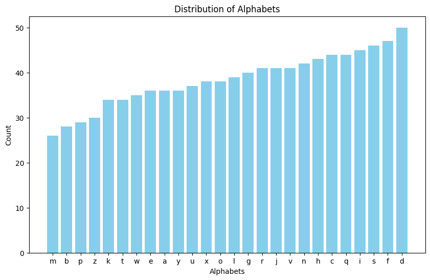
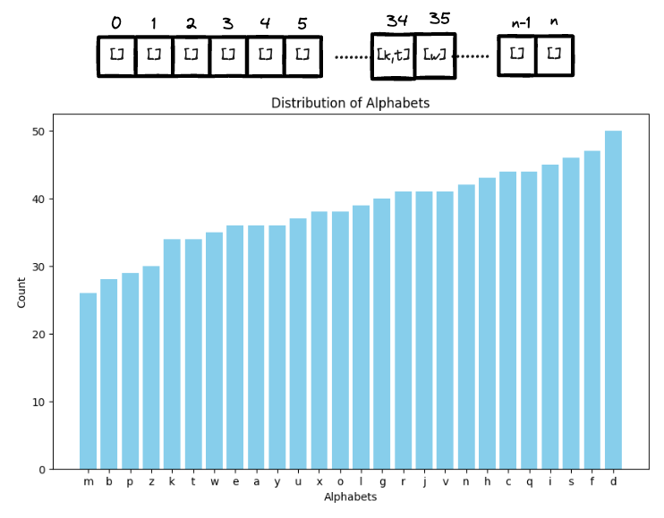

---
tags:
    - Array
    - Hash Table
    - Greedy
    - Sorting
    - Counting
    - Bucket Sort

---
# [1481 Least Number Of Unique Integers After K Removals](https://leetcode.com/problems/least-number-of-unique-integers-after-k-removals/description/?envType=daily-question&envId=2024-02-16)

## Approach 1 Bucket Sort

这题我的思路是, 
Step 1, 必须要先统计每个数字出现的次数, 自然想到的是用hashmap. Hashmap的长度就是unique number的个数.

Step 2, we sort by occurrence, 然后我们要删除k个数字, 并且求least number of unique, 那肯定是有一个按频率出现的统计分布的, 我们要从最小的频率开始删除, 直到k为0.

如下图所示



所以我们可以build一个array of size n+1, 把他们按照频率放进去, 然后从最小的开始删除, 直到k为0, 如下图



!!! warning Warning
    This is a very sparse array of size n+1, we can probably optimize it.


Then we traverse the array from the smallest frequency, and remove the number of elements from the array until k is equal or less than zeros. Need to handle three cases:

- `k > 0`: we still need to remove more elements, decrement the unique count by 1
- `k == 0`:, After this removal, we exactly removed k elements. decrement the unique count by 1 and return it
- `k < 0`:, after this removal, it means it's not enough to fully remove this alphabet at this frequency, still got some left. return the unique count


```python
from collections import defaultdict
class Solution:
    def findLeastNumOfUniqueInts(self, arr: List[int], k: int) -> int:
        # create an auxillary DS with val:count and sort it by count
        # start removing it from the count
        hashmap = defaultdict(int)
        n = len(arr)
        for num in arr:
            hashmap[num] += 1
        
        unique = len(hashmap)

        # left padding zero, 最多出现n次
        bucket = [[] for _ in range(n+1)]
        for val,count in hashmap.items():
            bucket[count].append(val)
        
        # removing stuff from the head of the bucket, since it has less count
        for i in range(len(bucket)):
            if len(bucket[i]) != 0:
                for j in range(len(bucket[i])):
                    k -= i
                    if k == 0:
                        return unique - 1
                    elif k < 0:
                        return unique
                    else:
                        unique -= 1
```
