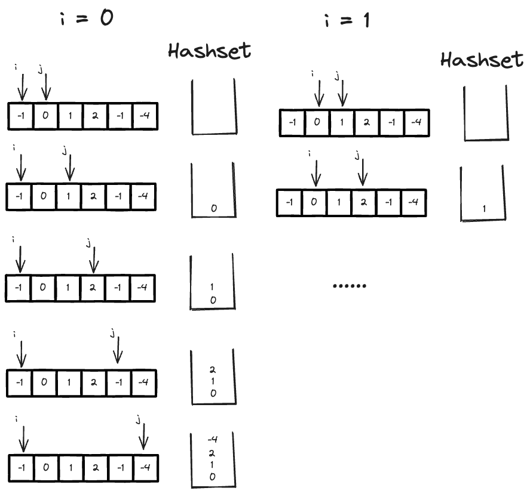
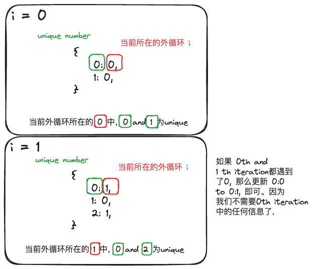
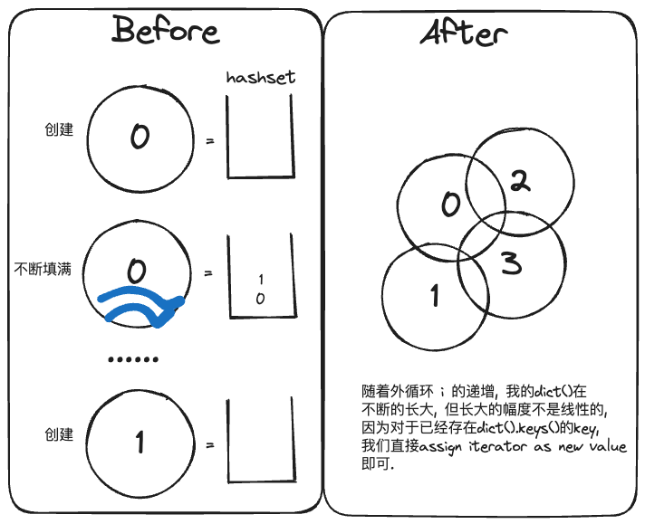

---
tags:
    - Array
    - Two Pointers
    - Sorting
---
# [15 Three Sum](https://leetcode.com/problems/3sum/description/)


## Approach 1 Brute Force

暴力解法就是三循环，然后找到所有的组合，然后去重，这个方法的时间复杂度是O(n^3)


## Approach 2 Hashset

如何在确保我们cover所有solution的前提下，speed up the brute force method呢？A hashset可以用空间换时间, 具体思路如下:
- 外循环pointer i 从0开始
- 内循环pointer j 从i+1开始
- 第三个index k 是从ranging from i to j的双开区间, 或者说`nums[i+1:j]`进行选择, 由于我们的i,j都已经确认了，所以我们只需要找到一个k使得`nums[i]+nums[j]+nums[k] = 0`即可，我们在储存这个incremental记录的时候，只需要储存deduplicated结果即可, 所以需要一个hashset来储存我们的结果, 每次到下一个i的时候，我们需要reset我们的hashset.



但这样就能保证我们的solution是unique的吗？并不是，我们目前定义的hashset，只负责在已经知道i,j的情况下，去重。虽然i,j能保证不一样，但是nums[i],nums[j]并不能保证不一样, 所以还是要进行deduplication with `tuple(sorted([nums[i],nums[j],nums[k]]))` as key to the hashset

!!! tip Tip
    去重的时候，我们pass in sorted tuple (1,2,3). 这个逻辑和anagram的时用tuple(sorted(str))是一样的，都是为了保证我们的key是unique的

### Code Implementation

```python
class Solution:
    def threeSum(self, nums: List[int]) -> List[List[int]]:
        # assuming i < k < j
        res = set()
        for i in range(len(nums)):
            # reset hash
            hashmap = set()
            for j in range(i+1,len(nums)):
                third = -nums[i]-nums[j]
                if third in hashmap:
                    res.add(tuple(sorted([third,nums[i],nums[j]])))
                hashmap.add(nums[j])     
        return res
```

### 微优化

但这一题还有微优化空间.

- `problem 1:` outer loop 可能有重复的nums[i], 可以去重
- `problem 2:` 我们每走过一次i, 都需要reset hashset

根据这两点，我们可以建立一个`set()` and `dict()` 来解决这两个问题. 为什么用dict? 

- key为unique value for `nums[k]`, 
- value为当前所在的outer iteration的index, `i`

举个例子,



这么做的好处是，不需要每次i变换，都reset hashset, 现在只需要在dict()里，随着i的变化，

- 如果value在`dict().keys()`, 覆盖掉之前的iterator即可.
- 如果value不在`dict().keys()`, assign value:iterator as the key:value pair即可

如下图所示, 



### 优化后 Code Implementation

```python
class Solution:
    def threeSum(self, nums: List[int]) -> List[List[int]]:
        outer_dups = set() # deduplication for nums[k]
        seen = dict() # deduplication for nums[i]
        res = set()
        for i in range(len(nums)):
            if nums[i] not in outer_dups:
                outer_dups.add(nums[i])
                for j in range(i+1,len(nums)):
                    third = -nums[i]-nums[j]
                    if third in seen and seen[third] == i:
                        res.add(tuple(sorted([third,nums[i],nums[j]])))
                    seen[nums[j]] = i
        return res
```


## Approach 2 Two Pointer

这题combine了two sum and two sum II, 


## Reference

- [take u forward, good as always](https://www.youtube.com/watch?v=DhFh8Kw7ymk&ab_channel=takeUforward)

