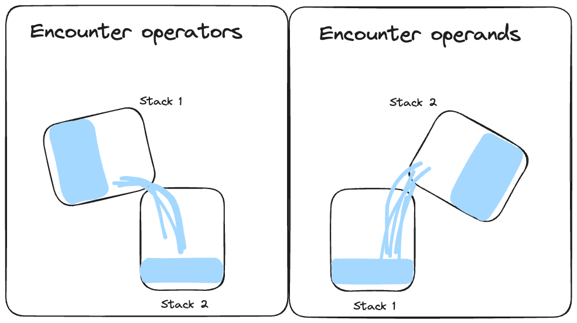

# Intuition

The pattern is always two operators follows one operand like this, 

```
["2","1","+"]
```

You have one input array, but you need to do the calculation from left to right. Popping the first element in an array is O(n), which is advised to avoid. So we can reverse the array to a stack, `S1`.  Now we just pop from there. 

> Note: One edge case doesn't fit the 2 operator + 1 operand pattern, which is `["2"]`, so we need to handle this edge case.

So we just need an auxillary DS to store the operators, and when we encounter an operand, we pop two operators from the auxillary DS, and do the calculation, then put the result back to the original stack. The auxillary DS is a stack as well, let's call it `S2`.

It's kinda like pouring water from one cup to another cup, and then pour it back.



# Example 

```
input: ["2","1","+","3","*"]
```

Initially, we have `s1` as reversed and `s2` as empty stack.

```
s1 = ["*","3","+","1","2"]
s2 = []
```
Then next two moves,
```
s1 = ["*","3","+",]
s2 = ["1","2"]
```
We encounter operand, we calculate the `temp = 1 + 2 = 3`, pop the operand in s1, and put `temp` back to `s1`

```
s1 = ["*","3","3"]
s2 = []
```
Then
```
s1 = ["*",]
s2 = ["3","3"]
```
Finally, 
```
s1 = ["9"]
s2 = []
```


# Solution


```python
class Solution:
    def evalRPN(self, tokens: List[str]) -> int:
        # use of two stack, O(n) in time, O(n) in space

        # edge case
        if len(tokens) == 1:
            return int(tokens[0])
        
        # reverse the stack
        s1 = []
        while tokens:
            s1.append(tokens.pop())
        
        s2 = []
        operands = ("+","-","/","*",)
        
        while s1:
            curr = s1[-1]
            if curr not in operands:
                # encounter a number
                s2.append(s1.pop())
            else:
                # encounter a operand
                operator_two = int(s2.pop())
                operator_one = int(s2.pop())
                if curr == "+":
                    temp = operator_one + operator_two
                elif curr == "-":
                    temp = operator_one - operator_two
                elif curr == "*":
                    temp = operator_one * operator_two
                else:
                    # edge case, be careful that in python int/int != int 
                    temp = int(operator_one / operator_two)
                # remove the operand
                s1.pop()
                # then put calculated result back 
                s1.append(temp)

        return s2[0]            
```