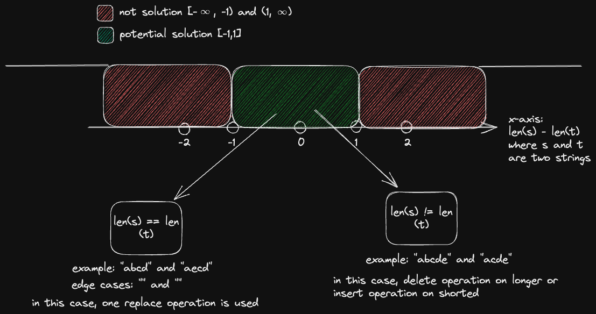

# Two pointers

我们可以用`len(s) - len(t)`作为判定条件，solution必然在$|len(s) - len(t)|\leq1$ 之间产生
- $len(s) == len(t)$, 只做一次`replace operation`
- $len(s) - len(t) == 1$, longer string do one `delete operation` while shorter string do one `insert operation`

具体图解如下图



## Code 
```python
class Solution:
    def isOneEditDistance(self, s: str, t: str) -> bool:
        # one edit distance必须满足以下几个cases
        # 1. s == t is true, 完全相等
        # 2. len(s) == len(t), 但有且仅有一个字符不同
        # 3. abs(len(s) - len(t)) == 1, 那么the larger one only has one unnecessary character
        if len(s) == 0 and len(t)==0: return False

        if abs(len(s) - len(t)) >= 2: return False
        
        if s == t: return False

        if len(s) == len(t):
            difference_counter = 0
            for i in range(len(s)):
                if s[i] != t[i]:
                    difference_counter += 1
                
                if difference_counter >= 2:
                    return False

        else:
            # 只剩下长度为1的了
            if len(s) > len(t):
                longer = s
                shorter = t
            else:
                longer = t
                shorter = s

            for i in range(len(shorter)):
                if longer[i] != shorter[i]:
                    if shorter[i:] == longer[i+1:]:
                        return True
                    else:
                        return False

        # 只剩下 case 1: remove last char in the longer string like "abcd" and "abcde"
        # case2: 完全相等 abcd = abcd
        return True
```