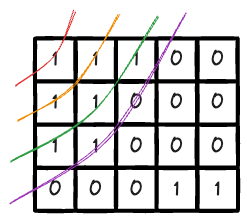

---
tags:
    - Array
    - Depth-first Search
    - Breadth-first Search
    - Union Find
    - Matrix
---

# [200 Number of Islands](https://leetcode.com/problems/number-of-islands/description/?envType=daily-question&envId=2024-04-19)

解的第一题graph, 很经典,  有以下几种做法:

- BFS
    - 用HashSet记录visited, O(MN), O(MN)
    - in-place修改grid, O(MN), O(min(M,N))
- DFS
    - in-place修改grid, O(MN), O(1)
- Union Find

!!! tip "DFS vs BFS"
    Graph algorithm学起来很上头，这个在porous medium之中计算pore size distribution等，可以说非常有帮助. Percolation theory etc. 

DFS是一条路走到黑之后(base case)，再回来去另一个方向. BFS是的如中心向外辐射.

## Approach 1: Breadth-first Search

用类比的思想比较一下我已经会的tree traversal:

|-|BFS in tree|BFS in graph|description|
|-|---|---|-|
|媒介|TreeNode|通常是Matrix|-|
|Auxillary DS|Queue|Queue,HashSet|需要HashSet记录有没有访问过，主要是因为在graph中的BFS可以往四个方向走，但tree中就一个方向|

为了更好的比较tree and graph BFS看看下图


那么对于这一题, BFS搜索示意图如下:




```python
from collections import deque
class Solution:
    def numIslands(self, grid: List[List[str]]) -> int:
        rows,cols = len(grid),len(grid[0])

        visited = set()
        num_of_islands = 0

        def bfs(r,c):
            # initialization of a grid
            diff = [(1,0),(-1,0),(0,1),(0,-1)]
            queue = deque()
            queue.append((r,c))
            visited.add((r,c))

            # BFS探索neighbours
            while queue:
                # 如果遇到一个valid node
                # 1. 不过边界
                # 2. 没有访问过
                # 3. 是陆地, "1"

                i,j = queue.popleft()
                for dr,dc in diff:
                    r,c = i + dr,j + dc
                    if (r >= 0 and r <= rows -1 and c >= 0 and c <= cols -1 and 
                    (r,c) not in visited and grid[r][c] == "1"):                    
                        queue.append((r,c))
                        visited.add((r,c))

        for r in range(rows):
            for c in range(cols):
                if grid[r][c] == "1" and (r,c) not in visited:                        
                    bfs(r,c)
                    num_of_islands += 1

        return num_of_islands
```

!!! note "Complexity"

    - Time complexity: $O(M \times N)$, 我们grid每一个点都要走一遍
    - Space complexity: $O(M \times N)$, 我们需要维护queue和HashSet, queue最坏情况下应该是能fit进入的rectangle最大周长或者对角线长度, HashSet最坏情况下也会有$O(M \times N)$个点. 所以不需要纠结queue最坏到底多少，下限为$O(M \times N)$.

所以这一题还有优化空间的可能性，我们可以修改input. 拿`grid`做我们的hashset!!(如果允许的话，可以问面试官). Worst case下，我们的space complexity可以降到$O(min(M,N))$, 也就是grid is filled with "1".

```python
from collections import deque
class Solution:
    def numIslands(self, grid: List[List[str]]) -> int:
        if not grid:
            return 0
        
        rows,cols = len(grid),len(grid[0])
        islands = 0
        for i in range(rows):
            for j in range(cols):
                if grid[i][j] == '1':
                    islands += 1
                    # mark as visited
                    grid[i][j] = '0'
                    q = deque([(i,j)])
                    
                    while q:
                        r,c = q.popleft()                      
                        if r-1 >= 0 and grid[r-1][c] == "1":
                            q.append((r-1,c))
                            grid[r-1][c] = "0"
                        
                        if r + 1 < rows and grid[r+1][c] == "1":
                            q.append((r+1,c))
                            grid[r+1][c] = "0"
                        
                        if c-1 >= 0 and grid[r][c-1] == "1":
                            q.append((r,c-1))
                            grid[r][c-1] = "0"
                        
                        if c+1 < cols and grid[r][c+1] == "1":
                            q.append((r,c+1))
                            grid[r][c+1] = "0"
        return islands
```


## Approach 2: DFS

in-place modification, O(MN), O(1)

```python
class Solution:
    def numIslands(self, grid: List[List[str]]) -> int:
        if not grid:
            return 0
        
        islands = 0
        rows,cols = len(grid),len(grid[0])

        def dfs(r,c):
            """只负责mark
            """
            # invalid, or encounter sea
            if r < 0 or r >= rows or c < 0 or c >= cols or grid[r][c] != '1':
                return
            # in-place modification
            grid[r][c] = '+'
            dfs(r+1,c)
            dfs(r-1,c)
            dfs(r,c+1)
            dfs(r,c-1)

        for i in range(rows):
            for j in range(cols):
                if grid[i][j] == '1':
                    dfs(i,j)
                    islands += 1
        return islands
```

## Approach 3 Union Find


```python
```