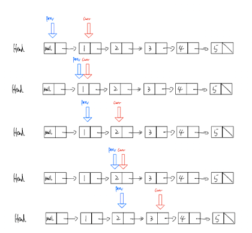

# Notes
## Sentinel Node/Dummy node
<!-- Describe your approach to solving the problem. -->
之前implement [singly linked list](/data%20structure%20implementaion/linked_list/SLinkedList.py) 时,有几个难点:
- insert and remove的不统一性:
  - `insert/remove` at top
  - `insert/remove` at middle
  - `insert/remove` at end

这时候需要用到一个technique来standardize和统一这个流程, 叫做dummy header node or sentinel node. 当你加了一个dummy node at the beginning of the linked list时, 所有的点都变为了middle node的处理方式;


如上图，如果我们现在做`remove(val = 1)`, 得分类讨论:
- 1 is store in the first node `probe = head; probe.next = None`
- 1 is stored in the middle node

sentinel的用法还会扩展到：
- head dummy node and tail dummy node
- used in tree to know the level


## two helper pointer
之前implement单链表时，我一般只用一个pointer来traverse, etc, 但就这一题来说，可以用两个pointer来mark previous location and current location. 实际上很像numerical method中记录last time step和current time step, 是一个generalization.你只需要不断shuffle就可以了, 具体概念如下图.



pointer `prev`和pointer `curr`不断向下

# Approach

# Complexity
- Time complexity: $O(n)$, one pass solution
<!-- Add your time complexity here, e.g. $$O(n)$$ -->

- Space complexity: $O(1)$
<!-- Add your space complexity here, e.g. $$O(n)$$ -->

# Code
```python
# Definition for singly-linked list.
class ListNode:
    def __init__(self, val=0, next=None):
        self.val = val
        self.next = next

class Solution:
    def removeElements(self, head: Optional[ListNode], val: int) -> Optional[ListNode]:
        """
        dummy node求解模式
        """
        dummy_node = ListNode(val = None,
                              next =None)
        dummy_node.next = head
        
        # 设置两个pointer记录previous location and current location
        prev,curr = dummy_node,head

        while curr:
            if curr.val == val:
                # 发现target了
                prev.next = curr.next
            else:
                # 没发现
                prev = curr
            
            curr = curr.next
            
        return dummy_node.next
```