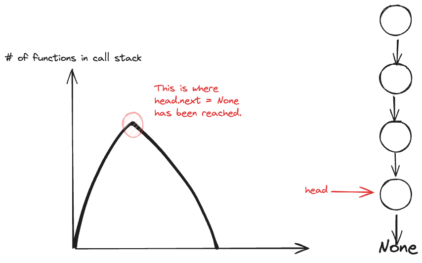

---
tags:
  - Linked List
  - Recursion
---

# [206 Reverse Linked List](https://leetcode.com/problems/reverse-linked-list/description/)

Good exercise to for learning the concept of recursion.

> Follow up: Reverse a linked list could also be solved both iteratively and recursively. Implement the recursive solution.

## Approach 1: iterative solution
<!-- Describe your approach to solving the problem. -->
How to reverse a linked list, 比较经典的一题, 同时考到了`linked list`和`two pointer technique`. 

这一题属于`two pointer technique`中的same-direction题型，同时俩pointer traverse at same speed but offset by one.

我第一次做这一题的时候，有几个错误思路:

- 将linked list一个一个放到array中; 然后reverse;然后重新插入 (当场veto, 肯定太慢过不了super long test cases)
- two pointer offset by one 

### Algorithm
<!-- Describe your first thoughts on how to solve this problem. -->

Set up two pointer `curr` and `prev`, which set to be the first node and null, respectively.


!!! warning
    在这里并不是设置了在链表中常见的dummy header node. 这里只是设置了`None`来标记reverse之后的linked list's tail node指向的`None`. 你可以把这个操作理解为left padding in array problems

由于pointer `curr`和`prev`做same direction scan, 要解决以下问题:

- 你肯定需要`curr.next = prev`将current node指向previous node, 但你会丢失next node在哪, 所以你需啊建立一个指针`temp`来指向next code (idea is exactly like int value swapping with `temp`)

第一个循环如下图:

- `temp = curr.next`: create a pointer points to next node
- `curr.next = prev`: points the current node to the previous node. 
- `prev = current`: previous pointer advances by one.
- `curr = temp`: current pointer advances by one


!!! tip
    这里的`curr`, and `prev`是一个指针, 他们指向的是一个node的地址. 通过他们俩之间的manipulation, 你可以改变node的指向

第二个循环也类似


由此直到`curr` pointer hits `null`,最后的diagram如下图, 这时候`curr` points to Null while `prev` is the new "head" for this reversed list. `return prev` 


!!! note "Time Complexity"
    Time complexity: $O(n)$ in time, $O(1)$ in space


### Code Implementation
```python
# Definition for singly-linked list.
class ListNode:
    def __init__(self, val=0, next=None):
        self.val = val
        self.next = next
class Solution:
    def reverseList(self, head: Optional[ListNode]) -> Optional[ListNode]:
        
        # Iteratative sotluon
        # set up two pointer
        prev = None
        curr = head

        while curr:
            # assuming curr at node[i], prev at node[i-1], index convention是根据old linked list

            # construct a temo points to node[i+1]
            temp = curr.next
            # points node[i] to node[i-1]
            curr.next = prev
            # update prev from node[i-1] to node[i]
            prev = curr
            # update curr pointer to node[i+1] (for the old linked list)
            curr = temp
        
        # iteration结束时, curr在null, prev是new head of the linked list
        return prev

```


## Approach 2: recursive solution

和iterative solution的从头往前的思路不同, recursive solution是从尾往前的思路. 

- `base case`: `head`为`[]` or `[1]` 这两种情况，直接返还`head`即可.
- `recursive case`: 递归调用`reverseList`函数, 直到`head`指向最后一个node时, 开始pop function from stack.

如下图所示, 函数不断堆积在call stack里，直到`head`指向最后一个node,终于满足`head.next is None`, 开始pop function from stack了



然后就到了第一个非base case的情况, 这时候`head`指向的是倒数第二个node, `head.next`指向的是最后一个node.

- `head.next.next = head`: 这一步是关键, 他是把`head`指向的node的next指向`head`本身, 这样就完成了reverse linked list的操作
- `head.next = None`: 斩断关系, 使得`head`指向的node的next指向`None`


!!! note
    要注意，其实每个function call都有自己的function scope, 他们之间的变量是不共享的. 完全靠各种`return`来传递消息，当然也有不靠`return`传递消息的方法，比如`global head`或者`nonlocal head` keyword to declare variable `head` to be exempt from being constrained in function scope and push their privilege to global or enclosing scope. 这种思路解题可以，但不适合industry level的代码, 由于会pollute global scope, 也不利于debugging.


### Code Implementation

```python
# Definition for singly-linked list.
# class ListNode:
#     def __init__(self, val=0, next=None):
#         self.val = val
#         self.next = next
class Solution:
    def reverseList(self, head: Optional[ListNode]) -> Optional[ListNode]:
        # base cases
        if not head:
            return head
        # 有用的base case其实是这个, 上一个只是为了number of nodes [0,5000]搞的edge case
        if not head.next:
            return head
        
        p = self.reverseList(head.next)
        head.next.next = head
        # 斩断关系
        head.next = None
        return p
```

## Reference

- [animation of recursively reverse a linked list](https://www.youtube.com/watch?v=MRe3UsRadKw&ab_channel=IDeserve)