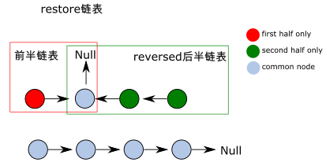

---
tags:
    - Linked List
    - Two Pointers
    - Stack 
    - Recursion
---

# [234 Palindrome Linked List](https://leetcode.com/problems/palindrome-linked-list/description/?envType=daily-question&envId=2024-03-22)


!!! warning "follow-up"
    follow-up, 要求$O(n)$ in time, $O(1)$ in space的解，在2021年作为facebook的面试题出现，问最优解.

简约但不简单, 数学的化归思想，可以把这个问题转化问已知的问题, 比如

- [125 Valid Palindrome](https://leetcode.com/problems/valid-palindrome/description/)
- [206 Reverse Linked List](https://leetcode.com/problems/reverse-linked-list/description/)

想到这两点是成功的一半，valid palindrome很容易想到，但是reverse linked list你想到的概率会小不少. 

## Approach 1 to array

按照wisdom peak的话，这题解法还不够优秀.

!!! note "complexity"
    - Time complexity: $O(n)$
    - Space complexity: $O(n)$

```python
# Definition for singly-linked list.
# class ListNode:
#     def __init__(self, val=0, next=None):
#         self.val = val
#         self.next = next
class Solution:
    def isPalindrome(self, head: Optional[ListNode]) -> bool:        
        if not head:
            return False
        
        res = []
        curr = head
        while curr:
            res.append(curr.val)
            curr = curr.next
        
        left,right = 0,len(res)-1
        while left < right:
            if res[left] != res[right]:
                return False
            left += 1
            right -= 1

        return True
```


## Approach 2: in-place reverse 
<!-- Describe your approach to solving the problem. -->
这个解法包括了以下几个技巧:

- `two runner pointer`
- `reverse a linked list`

!!! note
    in-place algo, 在concurrent setting会lock这个input till the operation on the input is done，这是in-place algo的通病


这一题的具体思路如下：

- write two helper functions:
    - `def reverse(self,head)`: return reversed linked list
    - `def mid_node(self,head)`: 找到linked list中点
- reverse the 2nd half of the linked list
- use `two pointers` to compare the first half and 2nd half from start to end
- restore the linked list by re-reverse the 2nd half


!!! tip
    `快慢指针`有几个作用, 

    - 快指针速度是慢指针两倍，可以determine `mid node` and `end node`. Generally, 我们可以找到1/3点，1/4点，1/5点等等 with different speed multiplier
    - cycle detection


<!-- Describe your first thoughts on how to solve this problem. -->
### Step1: two helper functions

For the `def reverse(self,head)`, refers to [206 reverse a linked list](https://leetcode.com/problems/reverse-linked-list/description/).

For the `def mid_node(self,head)`, 有两种思路:

- traverse with counter, then do floor division to get mid node
- 快慢指针

快慢指针technique设置了两个pointer moving at different pace, 由于我们是要找中点，所以设置的两个pointer, and they are `slow` and `fast` pointer, respectively. `fast`向前advancing的速度比`slow`快两倍, illustrated in the figure below


It stops until one of the next two nodes after `fast` is `null`

注意,由于panlindom linked list都拥有偶数个nodes，所以slow pointer会停在前半段的最后一个.


举个例子,如果你的`head = [1,2,3,4]` at beginning, 那么`slow = [2,3,4]` 


### Step2: reverse the 2nd half of the linked list

由于slow pointer停在前半段最后一个，reverse from slow pointer会造成如图的景象;


如果你的`head = [1,2,3,4]` at beginning, 那么`slow = [2,3,4]` ,然后你reverse了slow with `rev_half = self.reverse(slow)`,你的pointer就会变化如下:

- `head = [1,2]`
- `slow = [2]`
- `rev_half = [4,3,2]`

这种情况node with value 2被两个链表同时占有，同时`slow` pointer正好指向last non-null node in both linked list.

### Step3: compare two linked list

这一步很简单，只需要traverse两个list, 逐个比较就可以了，注意由于前半链表永远比后半链表少一个node, 循环条件要注意


### Step4: restore

It's a good practice to restore the input `head` since `head` might also be used in other functions.

`self.reverse(second_half)` 就可以了,因为它会修改second half linked list, 当你用指针`head`来traverse时，原先的断点已经被修复了




!!! note "Complexity"
    - Time complexity: $O(n)$    
    - Space complexity: $O(1)$


### Code Implementation

```python
# Definition for singly-linked list.
# class ListNode:
#     def __init__(self, val=0, next=None):
#         self.val = val
#         self.next = next
class Solution:
    def isPalindrome(self, head: Optional[ListNode]) -> bool:
        """
        1. reverse the half of linked list
        1 -> 2 -> 2 -> 1
        1 -> 2 -> 1 -> 2
        i.        j

        1 -> 2 -> 3 -> 2 -> 1
        
        1.1 finding the middle index
        1.2 reverse linked list
        
        2. reverse it!!
        3. use two separate pointers on two array to traverse to determine if it's palindrom
        4. restore it
        """
        def get_mid(head):
            end = head
            mid = head
            while end and end.next:
                mid = mid.next
                end = end.next.next
            return mid
        
        def reverse(head):
            if not head:
                return None                
            curr,prev = head,None
            while curr:
                temp = curr.next
                curr.next = prev
                prev = curr
                curr = temp
            
            return prev
        
        mid = get_mid(head)
        mid_head = reverse(mid)

        left = head
        right = mid_head
        
        flag = True
        while left and right:
            if left.val != right.val:
                flag = not flag
                break
            left = left.next
            right = right.next
        
        # we have to reverse the likedin list back no matter what we return
        reverse(mid_head)

        return flag
```