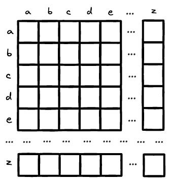

---
tags:
    - Hash Table
    - String
    - Dynamic Programming
---

# 2370 Longest Ideal Subsequence

## Approach 1 TLE

Same as LIS, but input size is $10^5$, which means it only takes up to $O(n)$ or $O(nlogn)$ time complexity. This one is $O(n^2)$, so it will TLE.

```python
class Solution:
    def longestIdealString(self, s: str, k: int) -> int:
        n = len(s)
        dp = [1 for _ in range(n)]

        for i in range(1,n):
            for j in range(i):
                if abs(ord(s[i]) - ord(s[j])) <= k:
                    dp[i] = max(dp[i],dp[j]+1)
    
        return max(dp)
```

## Approach 2

`abcda` and `abcca` has the same length. Whether it's a valid subsequence or not, only depends on the most adjacent pair, so our state can be simplified to a 26 x 26 size array.



We only need 26 x 26 states to describe all the possible subsequence. However, we can simplify it even further to a 1-D array of 26. Since we don't really even care the first character, we only care about the previous character to see if we can insert anything into it.
Therefore, a 1D array is enough to describe the state.

```
dp = [0] * 26
```

Algorithm:

- initialize an array of 26 with zeros. indicate we haven't seen any character yet.
- iterate through the string $O(n)$
    - iterate through every alphabets character, we find the longest previous character that can be inserted into it $O(26)$
    - update the current character's value with the candidate (previous character + 1)
    - update the result to the maximum value of the current character

### Code Implementation

```python
class Solution:
    def longestIdealString(self, s: str, k: int) -> int:
        """
        - highly likely a DP since subsequence;
        - 脑补一下的话，是一条曲折的线，然后画y = a to y = a+k 之间所有的线，找到经过最多的交点;
        """
        n = len(s)
        dp = [0] * 26
        res = 0
        for i in range(n):
            curr = ord(s[i]) - ord('a')
            best = 0
            # 找到符合条件的，上一个最大的值
            for prev in range(26):
                if abs(prev - curr) <= k:
                    best = max(best,dp[prev])
            # subsequence ending with s[i], update it
            dp[curr] = max(dp[curr],best+1)
            res = max(res,dp[curr])
        return res
```
