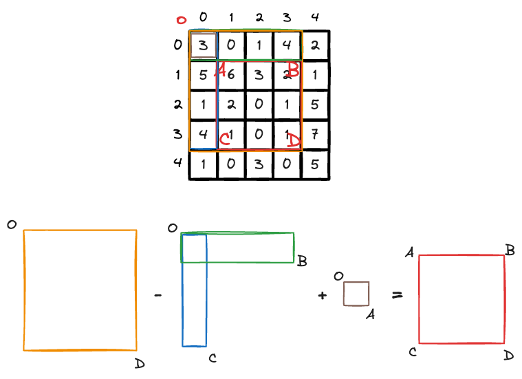
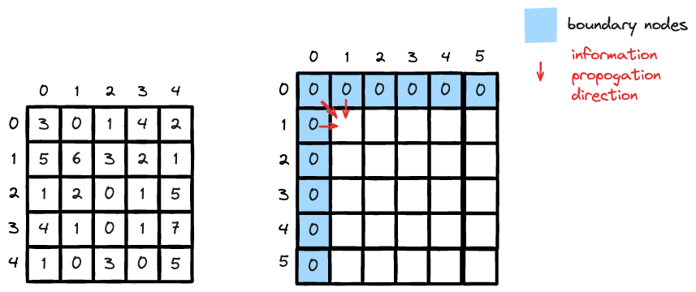

---
tags:
    - Prefix Sum
    - Array
    - Matrix
    - Design
---

# 304 Range Sum Query 2D - Immutable

Prefix Sum的2D matrix 扩展

- pre-processing to get prefix sum matrix (the method is similar to DP in 2D)
- use dp to get the regional sum of interest in O(1) time

## Approach 1 Prefix Sum

Prefix sum --> 2D的思维扩展, intuition is by `inclusion-exclusion`,



The idea of inclusion-exclusion is basically,

$$
SUM(ABCD) = SUM(OD) - SUM(OB) - SUM(OC) + SUM(OA)
$$

Then we need to pre-processing and compute a matrix such that we can get the accumulative sum from origin (0,0) to (x,y). This idea is exactly like DP in 2D, as illustrated in the figure below,




> The definition of `dp[i][j]`: regional sum from (0,0) to (i,j) where i and j are the row and column number.

Generalize it 

$$
dp[i][j] = \begin{cases}
0 \quad \text{if i = 0 or j = 0}\\
dp[i-1][j] + dp[i][j-1] - dp[i-1][j-1] + matrix[i][j] \quad \text{otherwise}\\
\end{cases}
$$

After you have to pre-processed regional sum matrix, the `SUM(ABCD)` can be computed by information in `dp` matrix.

### Code Implementation

```python
class NumMatrix:
    def __init__(self, matrix: List[List[int]]):
        self.matrix = matrix
        # number of rows and columns
        rows,cols = len(matrix),len(matrix[0])
        
        # initialize prefix sum (but in 2D): (0,0) to (x,y)的regional sum
        # 第一行和第一列卫boundary nodes
        dp = [[0 for _ in range(cols+1)] for _ in range(rows+1)]  
        for i in range(rows):
            for j in range(cols):
                dp[i+1][j+1] = dp[i+1][j] + dp[i][j+1] + matrix[i][j] - dp[i][j]

        self.dp = dp
    def sumRegion(self, row1: int, col1: int, row2: int, col2: int) -> int:
        """
        (row1,col1) - upper left
        (row2,col2) - lower right
        """
        return self.dp[row2+1][col2+1] - self.dp[row1][col2+1] - self.dp[row2+1][col1] + self.dp[row1][col1]     
```

We can also use a matrix of tuple so we don't worry about boundary as well. Although you don't have to deal with boundary, but you cost more time due to it's generally slower to access a hash table than a list.

```python
from collections import defaultdict
class NumMatrix:
    def __init__(self, matrix: List[List[int]]):
        self.matrix = matrix
        
        dp = defaultdict(int)

        rows,cols = len(matrix),len(matrix[0])

        for i in range(rows):
            for j in range(cols):
                dp[(i,j)] = dp[(i-1,j)] + dp[(i,j-1)] - dp[(i-1,j-1)] + matrix[i][j]
        
        self.dp = dp
    def sumRegion(self, row1: int, col1: int, row2: int, col2: int) -> int:
        return self.dp[(row2,col2)] - self.dp[(row2,col1-1)] - self.dp[(row1-1,col2)] + self.dp[(row1-1,col1-1)]        
```