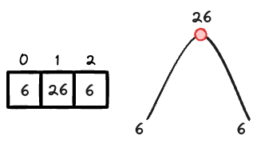

---
tags:
    - Monotonic Stack
---

# [3113 Find the Number of Subarrays Where Boundary Elements Are Maximum](https://leetcode.com/problems/find-the-number-of-subarrays-where-boundary-elements-are-maximum/description/)


比赛中一直尝试用monotonically increasing stack + hashmap for counting来做，但一直没写出来，原因就是没有理解好题目，在硬凑. 我们首先明白的是:

- 我们需要一个计数器，记录每一个元素遇到的次数
- 我们需要一个monotonic stack
    - 单调递增stack， 则盏顶为最大值
    - 单调递减stack， 则盏底为最大值

我们在每次遇见一个curr max时，我们需要清空之前的所有信息，对于`[6,26,6]`这样的array来说，在遇到26时，之前遇到的6已经没有意义了.



与之对应的，`[6,1,6]`则可以构成一个符合条件的array. 因此我们的solution必须能处理这两种情况，

```python
# peak
[6,26,6]
# valley
[6,1,6]
```

单调递增盏不会剔除比最大值小的元素，这是我们选择用单调递增还是递减的关键。同时我们可以把hashmap的功能，直接放在stack中，为什么这样做呢？因为我们只关心当前遇到的这个数`num`在以前有没有遇到过.

- 建立一个stack, 严格递减
- 维护一个res, 用来记录符合条件的subarray的个数
- 循环nums:
    - 常规操作，维护严格单调递减stack
    - 如果盏顶元素和新进入元素相等，则更新盏顶元素的计数器，跳过后续操作
    - 否则，将新元素加入stack, 并更新res

## Approach 1 Monotonic Stack

```python
class Solution:
    def numberOfSubarrays(self, nums: List[int]) -> int:
        """
        observation:
        - count subarray系列题目
        - condition: arr[0] arr[-1] are the min and max of the subarray
        - nums[i] >= 1, 所以可以用sliding window,也有可能是monotonic queue        
        - monotically increasing queue (不需要strictly)
        intuition:
        - monotonically decreasing stack
        """
        stack = []
        res = 0
        
        for num in nums:
            while stack and stack[-1][0] < num:
                stack.pop()
            if stack and num == stack[-1][0]:
                stack[-1][1] += 1
                res += stack[-1][1]                
                continue
            stack.append([num,1])
            res += stack[-1][1]
            
            
        return res
```