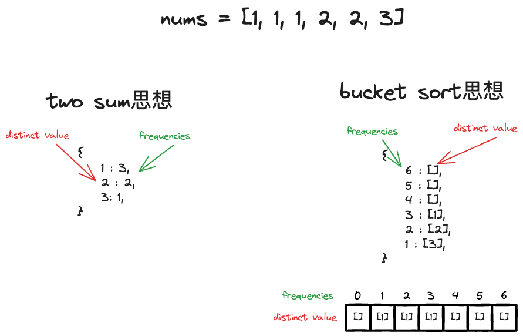

# Approach 1 Naive Solution


自己想出来的naive解，O(nlogn) in time, O(n) in space.

```python
class Solution:
    def topKFrequent(self, nums: List[int], k: int) -> List[int]:
        # hashmap to record: 
        #      val:occurence
        # O(n*logn) in time, O(n) in space
        hashtable = collections.defaultdict(int)
        for num in nums:
            hashtable[num] += 1
        
        sorted_hashtable = sorted(hashtable,key=lambda x:hashtable[x],reverse = True)

        return sorted_hashtable[:k]
```


# Approach 2 Using bucket sort

Neetcode的解法 O(n) in time, O(n) in space. 比较巧妙是，用了bucket sort的思想，把频率作为index，然后把频率相同的元素放在一个list里面。这样就可以直接从高频率开始取元素了. 

!!! tip Tip
    为什么bucket sort算法会快呢? 本质上是把一个unbounded problem转化为bounded problem. 你的输入array `nums = [1,2,...1000000]` 里的value的范围非常广，但是你的频率的范围则永远和`len(nums)`一样。也就是你有个size 6的array, 频率次数只可能是1-6. 所以你可以把这个unbounded problem转化为bounded problem.

这个思路和2-sum实际上是一个非常comparable, 对比如下,



算法复杂度有点搞脑子，假设你的input array is size n. 那么每种元素最多出现n次，所以最多有n种不同的频率。所以最多有n个bucket。所以最多有n个list. 但这n个list里，一共有的elements数量也为n个，每一个都visit一遍。所以总的时间复杂度为O(n).

!!! note Note
    bucket sort的精髓在于bucket的定义, 这个定义完全依赖于你需要求的问题. 比如这个问题是求频率最高的k个元素，那么bucket的定义就是频率。如果是求最大值，那么bucket的定义就是value的范围,具体如下图.


下面的例子用了list of list的方式，但是其实用defaultdict也是可以的。

## With list of list
```python
class Solution:
    def topKFrequent(self, nums: List[int], k: int) -> List[int]:
        # bucket sort, O(n) in time, O(n) in space

        # cost O(n) time 
        hashtable = collections.defaultdict(int)
        for num in nums:
            hashtable[num] += 1
        # cost O(n) space
        freq = [[] for _ in range(len(nums)+1)]

        # cost O(n) time
        for num,count in hashtable.items():
            freq[count].append(num)
        
        # cost O(n), since we gonna have x vals, where x == len(nums)
        res = []
        for count in range(len(freq)-1, 0, -1):
            # on average, we have O(1) time to get the value
            # 平均下来每个frequency一个元素
            for val in freq[count]:
                res.append(val)                
                if len(res) == k:
                    return res
```

## with defaultdict
下面是用defaultdict的例子
```python
from collections import defaultdict
class Solution:
    def topKFrequent(self, nums: List[int], k: int) -> List[int]:
        hashmap = defaultdict(int)
        for num in nums:
            hashmap[num] += 1

        bucket = defaultdict(list)
        for val,freq in hashmap.items():
            bucket[freq].append(val)

        # traverse from len(nums) to 1
        res = []
        for freq in range(len(nums), 0, -1):
            for n in bucket[freq]:
                res.append(n)
                if len(res) == k:
                    return res            
```
