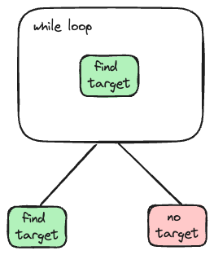

---
tags:
    - Binary Search
    - Array
---
# [35 Search Insert Position](https://leetcode.com/problems/search-insert-position/description/?envType=study-plan-v2&envId=binary-search)

## Approach 1 left < right

当`while left < right:`, 我们有两种可能:

- **CASE 1:** 找到了target, 返回mid
- **CASE 2:** 跳出`while left < right:`的循环，跳出的时候`left >= right`, 或者再specific一点, 要么`left = right`, 要么`left = right + 1`. 但要注意，可能会有target虽然在nums中，但是没从case 1中return.
    - Case 2.1: `left = right`, 
        - 最后一步更新`left = mid + 1`
        - 最后一步更新`right = mid + 1`
    - Case 2.2: `left = right + 1`
        - 最后一步更新`left = mid + 1`
        - 最后一步更新`right = mid + 1`

!!! note note
    为什么是**case 2**只可能是`left = right` or `left = right + 1`? 因为每次left or right pointer的update, 到最后只increment or decrement by one, 也就不会有offset by 2的情况.

我们来看一下下面流程图, 这个函数一共也就return三种情况, 

- 在循环时，找到了target, 直接return mid
- 跳出循环后，找到了target
- 跳出循环后，没找到target



### 以`nums[left]`为判定条件

对于**case 2**, 我们虽然知道left == right, 但我们并不知道`nums[left]和target之间的关系`, 需要做个判定. 

- 当`nums[left] >= target`: 
- 当`nums[left] < target`: 那么`left + 1`就是我们插入的位置.


```python
class Solution:
    def searchInsert(self, nums: List[int], target: int) -> int:
        left,right = 0,len(nums)-1

        while left < right:
            mid = (left+right)//2
            if nums[mid] == target:
                return mid
            elif nums[mid] > target:
                right = mid - 1
            else:
                left = mid + 1
        
        if nums[left] >= target:
            return left
        else:
            return left + 1
```

### 以`nums[right]`为判定条件

```python
class Solution:
    def searchInsert(self, nums: List[int], target: int) -> int:
        left,right = 0,len(nums)-1

        while left < right:
            mid = (left+right)//2
            if nums[mid] == target:
                return mid
            elif nums[mid] > target:
                right = mid - 1
            else:
                left = mid + 1
        
        if nums[right] == target:
            return right
        elif nums[right] < target:
            return right + 1
        else:
            if right - 1 < 0:
                return 0
            else:
                return right
```

!!! warning Warning
    为什么依据`nums[left]`作为判定比`nums[right]`要简单呢？是因为array插入的边界, 一个长度为n的数组，你可以插入的位置是0到n. 当你用`nums[right]`作为判定条件, 由于right <= left, 也就是说你有一定几率需要插在right pointer的左边. 如果right pointer 指向的是0, 那么你就需要特殊处理一下. 但是如果你用`nums[left]`作为判定条件, 由于`left > right`, 也就是说，你往left左边插肯定没问题，往left右边插也没问题, 最坏的case是对一个length为n的数组，你插在n的位置，也不会有out-of-bound的问题.

## Approach 2 left <= right

当left<= right你跳出来的时候，left = right + 1恒成立这一种可能，那么我们可以得到一下结论,

```
nums[left] will be first value > target, and nums[right] will be the last value < target
```

既然，left != right, 那你插入的时候就恒成立插入在left的位置.

```python
class Solution:
    def searchInsert(self, nums: List[int], target: int) -> int:
        left,right = 0,len(nums)-1

        while left <= right:
            mid = (left+right)//2
            if nums[mid] == target:
                return mid
            elif nums[mid] > target:
                right = mid - 1
            else:
                left = mid + 1
        
        # left = right + 1 and nums[left] will be first value > target
        # and nums[right] will be the last value < target
        return left
```