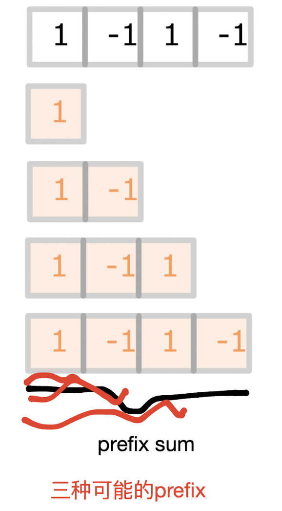

# Readme

Hash + prefix sum解法，思路有点像two sum, 由于是求两者之和等于target的题目，这一题有意思的是prefix sum的解法, 思路是这样的，如果你计算accumulative sum, 你可以这样做, 




pre-fix sum基于的理论是:
- 任何一个sub-array, 都可以由two sub-array的差值来构建出来.


迭代到在任何一个时间点`i`的prefixSum的值，在删去一些前缀array之后，能组合成任何一个以`nums[i]` 为结尾的subarray, 这样你只要iterate one pass, 就能考虑到所有subarray的情况;

其实很像数轴标根穿针引线法的思路，当你前面满足了x个particular sum等于某个数的时候，就相当于多了x种可能性.


```python
class Solution:
    def subarraySum(self, nums: List[int], k: int) -> int:
        # hash key-value pair
        # any particular sum: how many times it happens
        count = 0
        prefixSum = 0
        prefixSumHash = {0:1} # initialze {0,1}, 来计算那些num[i]==k的情况

        for i in range(0,len(nums)):
            # update sum
            prefixSum += nums[i]
            # check if target in it (思路很像two sum)
            diff = prefixSum - k
            if diff in prefixSumHash:
                count += prefixSumHash[diff]
            
            if prefixSum in prefixSumHash:
                prefixSumHash[prefixSum] += 1
            else:
                prefixSumHash[prefixSum] = 1
            
        return count

```

这题思路的进阶2D版是[1074 Number of Submatrices That Sum to Target](https://leetcode.com/problems/number-of-submatrices-that-sum-to-target/description/?envType=daily-question&envId=2024-01-28)

