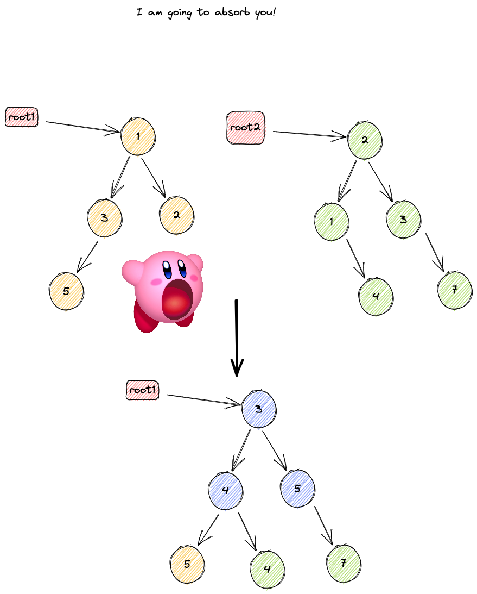

# Problem

You are given two binary trees `root1` and `root2`.

Imagine that when you put one of them to cover the other, some nodes of the two trees are overlapped while the others are not. You need to merge the two trees into a new binary tree. The merge rule is that if two nodes overlap, then sum node values up as the new value of the merged node. Otherwise, the NOT null node will be used as the node of the new tree.

Return the merged tree.

Note: The merging process must start from the root nodes of both trees.

Example: please see the diagram below

# Solution

The key for this problem is to:
- take `left tree` as a basis and add `right tree`'s stuff to it
- traverse the left tree as always.

