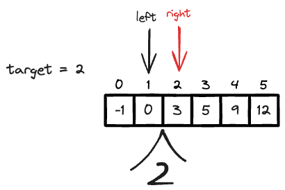

---
tags:
    - Binary Search
    - Array
---

# [704 Binary Search](https://leetcode.com/problems/binary-search/description/?envType=study-plan-v2&envId=binary-search)

# Approach 1 Binary Search

答案很简单，如下

```python
class Solution:
    def search(self, nums: List[int], target: int) -> int:
        left,right = 0,len(nums) - 1
        
        while left <= right:
            mid = (left + right)//2
            if nums[mid] == target:
                return mid
            elif nums[mid] < target:
                left = mid + 1
            else:
                right = mid - 1
        
        # 等号的意义, 输出的时候，left在right的右边，且left = right + 1
        return -1
```


难点是理解`while left <= right`的意义, 当跳出while循环的时候，left在right的右边，且left = right + 1. 这代表着两件事:

- **CASE 1:** 如果已经找到了target, 在while内已经返回mid. 那么现在直接在loop中`return mid`
- **CASE 2:** 一旦跳出`left <= right`的循环，left = right + 1, 代表着`left`在`right`的右边，且`left`指向的是第一个大于`target`的数，`right`指向的是最后一个小于`target`的数。

但为什么Case2是`return -1`?, 这个状态如下图所示,



既然`while left <= right:`, 那么我们有
$$
\begin{equation}
left = right + 1
\end{equation}
$$

其实就是solution space为空集，保证**case1** and **case2**的全集能够被覆盖到. 如果我左指针都到右指针的右边了，我也有一个让你跳出循环的条件`if nums[mid] == target:`, 你还是走过了所有的while循环，那么就说明所有解里面都没有你要找的解，那么就返回-1.
