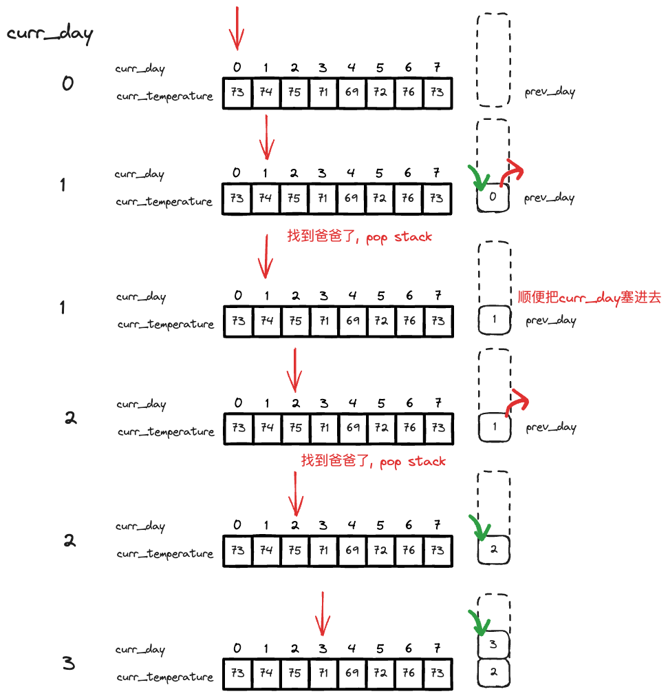
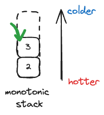
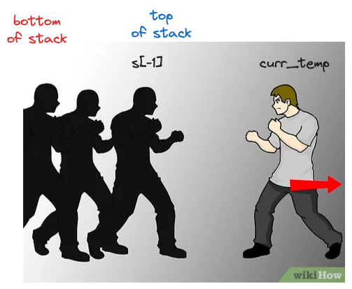

---
tags:
    - Array
    - Stack
    - Monotonic Stack
---

# [739 Daily Temperatures](https://leetcode.com/problems/daily-temperatures/)

这题有三种解法，

- Brute Force
- Monotonic Stack (optimal)
- Array, Space optimized (不会)

## Approach 1: Brute Force

最简单的方法是使用两个指针，一个指针指向当前的温度，另一个指针指向当前温度的下一个温度。如果下一个温度比当前温度高，那么就找到了答案。如果没有找到，就继续移动指针。我想出来了这个，可惜time limit exceeded了。

!!! note    "复杂度"
    $O(n^2)$ time complexity, $O(n)$ space complexity.


### Code Implementation

可惜TLE了

```python
class Solution:
    def dailyTemperatures(self, temperatures: List[int]) -> List[int]:
        # answers[i]: # of future days needed to get a higher temperature
        # two pointer
        left = 0
        right = left + 1
        ans = []
        while left <= right and left < len(temperatures):
            if right == len(temperatures):
                # went beyond the length of array, no possible solution found, time to reset
                ans.append(0)
                left += 1
                right = left
            elif temperatures[right] > temperatures[left]:
                # found the solution, mark it down
                ans.append(right - left)
                left += 1
                right = left
            else:
                # move the next
                right += 1

        return ans
```

## Approach 2 Monotonic Stack

Monotonic stack is a stack that is either strictly increasing or strictly decreasing. 也就是严格单调递增或者递减的一种数据结构.

!!! help Help
    Monotonic stack is good for finding the nearest biggest or nearest smallest element in an array, 因为其严格的单调性. 类似的还有monotonic queue.

这里我们可以用monotonic stack来储存所有等待寻找比它温度高的温度的index。We traverse the original array, 每当遇到一个新的温度时，我们做以下判断，

- 如果上一个iteration塞进去的, `stack[-1]`所指向的温度比当前温度低，那我们就找到答案了，我们就pop出来，然后记录答案。
- 如果上一个iteration塞进去的, `stack[-1]`所指向的温度比当前温度高，那我们还没有为`stack[-1]`找到答案，那就把当前温度的index塞进去。

如下图所示, 



这一题需要搞清楚两点,
- `answer[i]`这个array, 我们并不是按照顺序寻找答案的. 
- `stack`越上面的, 温度越低，因为所有比它温度高的都已经被pop出去了。




另一个点是，这里用的
```python
while stack and temperatures[stack[-1]] < curr_temp:
```

Instead of
```python
if stack and temperatures[stack[-1]] < curr_temp:
```

是因为我们是个one-pass solution, 当我们遇到一个新的temp的时候，我们比较curr_temp和top of stack的温度 (在monotonic stack中是最低的，最弱的温度)，所以我们需要`while` loop让curr_temp来打擂台赛，直到输掉.





### Code Implementation

!!! warning "注意"
    记住，每当我们pop出任何一个元素的时候，我们都找到了the first element in `temperatures` that is greater than it. 


```python
class Solution:
    def dailyTemperatures(self, temperatures: List[int]) -> List[int]:
        # a monotonic stack, with hotter temperature at bottom of the stack
        stack = []
        ans = [0] * len(temperatures)

        for curr_index, curr_temp in enumerate(temperatures):
            # we found a match for top of the stack
            while stack and temperatures[stack[-1]] < curr_temp:
                prev_index = stack.pop()
                ans[prev_index] = curr_index - prev_index
            # cuz every temperature needs to be solved
            stack.append(curr_index)
        return ans
```

## Approach 3: Array, Space optimized

$O(n)$ in time, $O(1)$ in space. 这个解法太牛逼了，以后再学吧. Monotonic stack来找nearest greater 就足够强大了.


