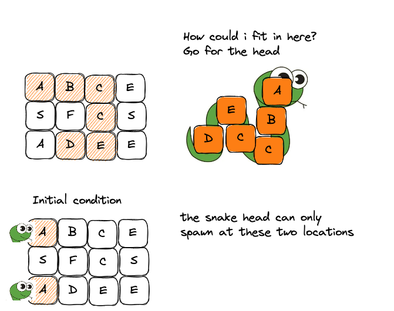

# 79 Word Search

Table of content:
- [79 Word Search](#79-word-search)
- [Problem Statement](#problem-statement)
- [Approach 1: DFS](#approach-1-dfs)
  - [Intuition](#intuition)
  - [dfs函数设计](#dfs函数设计)
  - [Trick](#trick)
  - [复杂度分析](#复杂度分析)
  - [Code Implementation](#code-implementation)
- [Reference](#reference)


# Problem Statement
Given an `m x n` grid of characters board and a string word, return true if word exists in the grid.

The word can be constructed from letters of sequentially adjacent cells, where adjacent cells are horizontally or vertically neighboring. The same letter cell may not be used more than once.

Example 1    


> **Input**: board = [["A","B","C","E"],["S","F","C","S"],["A","D","E","E"]], word = "ABCCED"
> 
> **Output**: true

# Approach 1: DFS

## Intuition

这道题目让我想到贪吃蛇，很类似，在一个rectangle中，找到一个word，这个word可以是任意方向，但是不能重复使用同一个cell.


而在这里，这个word就是蛇，而board就是这个rectangle. 假设我们要找的`word = "ABCCED"`, 我们第一步也就是找到蛇头的位置



然后蛇怎么样才能生长呢? 也就是string中下一个char, 在我四周的cell中，有没有和我下一个char相同的cell呢? 如果有，我就可以生长，如果没有，这里就长不出一条满足条件的蛇.


具体的思路为:
- traverse一遍所有的cell，找到第一个和word的第一个字母相同的cell, 也就是确定蛇头的位置.
- 每一个蛇头，开展一个recursive DFS，找到所有的可能性，如果有一条蛇能够找到.
    - `贪吃蛇成长条件`: 在蛇头的四周，有一个cell和word的下一个字母相同. 且这个单元不能是蛇身体其它部位(访问过).
    - `贪吃蛇阵亡条件`:
      - 不能碰到自身
      - 不能出界
    - `贪吃蛇胜利条件`: 找到了word的最后一个字母

For those who are a bit nerdy, we could go for a more formal definition of the problem:

|-|-|
|-|-|
|initial condition|traverse|

> 传统思维方式:
> 
> backtracking题目, 脑袋里先想出一个N叉树，每一个树的node代表着一次recursive call to `dfs function`.

## dfs函数设计

`dfs(board, word, i, j, k)`: 从`board[i][j]`开始，是否能够找到`word[k:]`，如果任何一条支路能够找到，返回`True`，否则返回`False`

## Trick
如何保证自己不吃回头草呢?
- neetcode用了`path = set()`, 来记录已经访问过的cell，每个cell存成一个tuple, 也就是`path.add((r,c))` where `r` is row and `c` is column.
- 花花酱用了`board[r][c] = 0`，把当前的cell的值改成0，这样就不会和word中的任何一个char相等了.别忘了要换回来

## 复杂度分析

- `time complexity`:$O(m\times n \times 3^{L})$ where m and n are the number of rows and columns of the board and L is the length of the word to be matched.
  - $m\times n$: traverse the board of size m and n.
  - $3^{L}$: for each cell, we have 3 choices to go, except the cell we just came from.
- `space complexity`: $O(L)$
  - The main consumption of the memory lies in the recursion call of the backtracking function. The maximum length of the call stack would be the length of the word. Therefore, the space complexity of the algorithm is $O(L)$.

## Code Implementation

胜利条件可以是`if i == len(word)-1: return True`
```python
class Solution:
    def exist(self, board: List[List[str]], word: str) -> bool:
        # get ROWS and 
        ROWS,COLS = len(board),len(board[0])

        # dfs helper function
        def dfs(r,c,i):
            # 1. out of bounds
            if (r < 0 or c < 0 or r >= ROWS or c >= COLS):
                return False
            
            # 2. character not match
            if word[i] != board[r][c]:
                return False

            # 3. found the last char
            if i == len(word) - 1: return True
            
            temp = board[r][c]
            # mark the current value as integer, so it is not matching
            # with any char in the word to prevent revisiting
            board[r][c] = 0

            res = (dfs(r + 1, c, i + 1) or
                   dfs(r - 1, c, i + 1) or
                   dfs(r, c + 1, i + 1) or
                   dfs(r, c - 1, i + 1))
            
            board[r][c] = temp

            return res

        for r in range(ROWS):
            for c in range(COLS):
                if dfs(r,c,0):
                    return True
        
        return False
```


也可以是`if i == len(word): return True`
```python
class Solution:
    def exist(self, board: List[List[str]], word: str) -> bool:
        # get ROWS and 
        ROWS,COLS = len(board),len(board[0])

        # dfs helper function
        def dfs(r,c,i):
            # 3. found the last char in last iteration
            if i == len(word): return True
            
            # 1. out of bounds
            if (r < 0 or c < 0 or r >= ROWS or c >= COLS):
                return False
            
            # 2. character not match
            if word[i] != board[r][c]:
                return False

            
            temp = board[r][c]
            # mark the current value as integer, so it is not matching
            # with any char in the word to prevent revisiting
            board[r][c] = 0

            res = (dfs(r + 1, c, i + 1) or
                   dfs(r - 1, c, i + 1) or
                   dfs(r, c + 1, i + 1) or
                   dfs(r, c - 1, i + 1))
            
            board[r][c] = temp

            return res

        for r in range(ROWS):
            for c in range(COLS):
                if dfs(r,c,0):
                    return True
        
        return False
```

为什么有俩胜利条件呢，且offset by one呢? 你可以思考一下哦.


# Reference

- [LC 79 花花酱](https://www.youtube.com/watch?v=oUeGFKZvoo4&ab_channel=HuaHua)
- [neetcode](https://www.youtube.com/watch?v=pfiQ_PS1g8E&ab_channel=NeetCode)
- [Abdul Bari, introduction to backtracking](https://www.youtube.com/watch?v=DKCbsiDBN6c&ab_channel=AbdulBari)