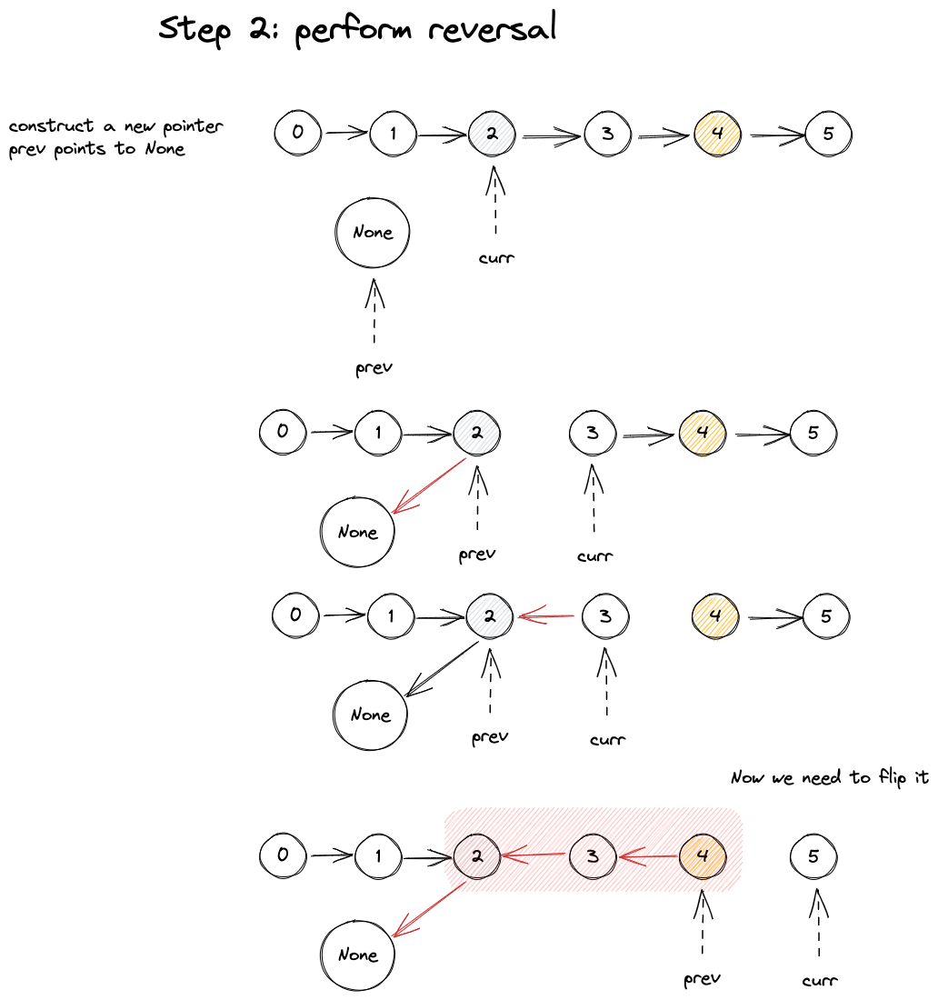

# Problem


# Intuition

For this problem, we need to break it down to three steps,

In step one, we need to create a dummy header node (good practice and generalization), we use two pointers technique to advance both `prevLeft` and `curr` pointer until `curr` points at left node.

```python
# construction dummy header node and points to head
dummy = ListNode(0,head)

prevLeft, curr = dummy,head
# advance (left - 1) times
for i in range(left - 1):
    prevLeft, curr = prevLeft.next, curr.next
```

> 当你分不清楚iteration几次的时候，代入left = 1, 并比较一下


For 2nd step, we need to perform the [206 reverse linked list I](https://leetcode.com/problems/reverse-linked-list/) on Leetcode, please refer to this question if you are confused.

For now, you need to construct a new pointer `prev`. Because we have to use the location of `prevNode` later.
```python
prev = None
for i in range(right - left + 1):
    temp = curr.next
    curr.next = prev
    prev = curr
    curr = temp
```


For the 3rd step, you notice two things:
- left node (node 2) is currently pointing to `None`
- node 5 is cut loose but we have `curr` pointer points to it so it doesn't get garbage-collected!
- `prevLeft` is node 1 and it still points to left node (`node 2`)
- `prev` points to right node

We summarize them into a table

|pointer|-|
|---|---|
|`prev`|points to right node (node 4)|
|`prevLeft`|points to the node before left node (node 1)|
|`curr`|points to the node after right node (node 5)|

In order to reach the target position, we need to
- point the node 1 to node 4
- point node 2 to node 5 

Then we put down the following codes

```python
prevLeft.next.next = curr
prevLeft.next = prev
```


# Solution
```python
# Definition for singly-linked list.
# class ListNode:
#     def __init__(self, val=0, next=None):
#         self.val = val
#         self.next = next
class Solution:
    def reverseBetween(self, head: Optional[ListNode], left: int, right: int) -> Optional[ListNode]:

        dummy = ListNode(0,head)

        prevLeft, curr = dummy,head
        for i in range(left - 1):
            prevLeft, curr = prevLeft.next, curr.next


        prev = None
        for i in range(right - left + 1):
            temp = curr.next
            curr.next = prev
            prev = curr
            curr = temp


        prevLeft.next.next = curr
        prevLeft.next = prev

        return dummy.next
```


