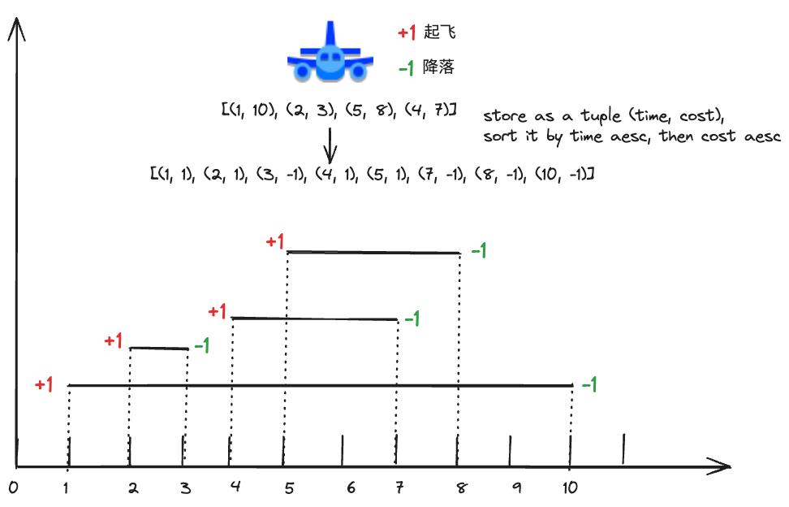

# Line Sweep Algorithm

> Line Sweep (扫描线)是一种算法技巧，隶属于computational geometry. 它的基本思想是通过扫描线的方式，在一个坐标系中扫来扫去，从而计算图形面积，周长，二位数点等问题.

在OI中，计算几何可以单独拎出来讲，但这里就不展开了。扫描线会经常和intervals打交道。这里我们会讲解一些常见的intervals题目，然后讲解一下扫描线的基本思想。


!!! note "lintcode 391数飞机"
    给出飞机的起飞和降落时间的列表，用序列 interval 表示. 请计算出天上同时最多有多少架飞机？
    !!! warning
        如果多架飞机降落和起飞在同一时刻，我们认为降落有优先权。
    Example 1:
    ```
    输入: [(1, 10), (2, 3), (5, 8), (4, 7)]
    输出: 3
    解释: 
    第一架飞机在1时刻起飞, 10时刻降落.
    第二架飞机在2时刻起飞, 3时刻降落.
    第三架飞机在5时刻起飞, 8时刻降落.
    第四架飞机在4时刻起飞, 7时刻降落.
    在5时刻到6时刻之间, 天空中有三架飞机.
    ```
    Example 2:
    ```
    输入: [(1, 2), (2, 3), (3, 4)]
    输出: 1
    解释: 降落优先于起飞. 
    ```

数飞机这个题目就是一个典型的扫描线算法的题目。我们可以把飞机的起飞和降落时间看成是一个interval，然后我们可以把这些interval的所有起飞和降落的时间点按照时间排序。只有这些时间点对空中飞机数量有影响。 扫描线的概念就是从左到右扫描，同时记录下来当前时间点的飞机数量。这样我们就可以得到天上同时最多有多少架飞机了。





## 相关题目

- [252 Meeting Rooms](https://leetcode.com/problems/meeting-rooms/description/)
- [253 Meeting Rooms II](https://leetcode.com/problems/meeting-rooms-ii/description/)
- intervals 三兄弟
    - [LC 56 Merge Intervals](https://leetcode.com/problems/merge-intervals/description/)
    - [LC 57 Insert Interval](https://leetcode.com/problems/insert-interval/description/)
    - [LC 1272 Remove Interval](https://leetcode.com/problems/remove-interval/description/)
- cover? non-overlap?傻傻分不清楚
    - [435 Non-overlapping Intervals](https://leetcode.com/problems/non-overlapping-intervals/description/)
    - [1288 Remove Covered Intervals](https://leetcode.com/submissions/detail/1208473214/)
- 1229 Meeting Scheduler
- 986 Interval List Intersections
- 759 Employee Free Time
- 218 The Skyline Problem


## Reference

- [古城,基础算法一,扫描线](https://www.youtube.com/watch?v=ihf8JjQdta0&t=1942s)
- [leetcode post by c0D3M, 一名C++选手](https://leetcode.com/discuss/study-guide/2166045/line-sweep-algorithms)
- [OI wiki](https://oi-wiki.org/geometry/scanning/)