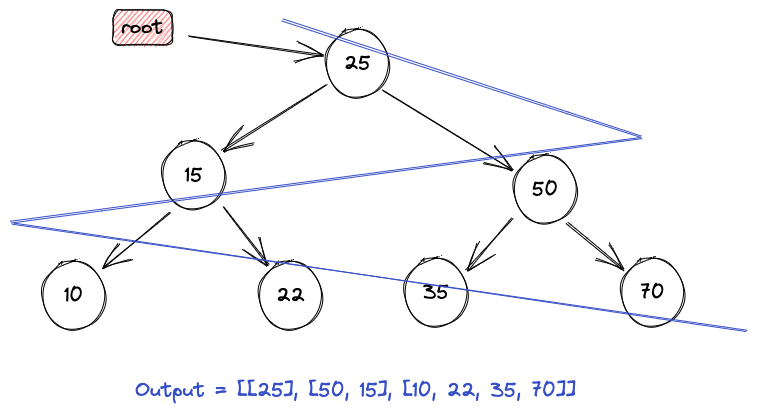

# Problem description

Given a binary tree, you are asked to do BFS search for the tree. You are traversing down layer by layer but in a zigzag format.

Example: 
```
    3
   / \
  9  20
    /  \
   15   7
```

It returns as (excluding `None`)
```
[
    [3],
    [20,9],
    [15,7]
]
```
# Algorithm

We don't know how to implement BFS in zigzag order but we could start from simpler BFS traversal. 

For BFS, we are going to need,
- queue as an auxillary to temporary hold the node



After we figure the regular BFS out for the tree diagram above, we will have
```
# BFS
[
    [25],
    [15,50],
    [10,22,35,70]
]

# BFS zigzag expected output
[
    [25],
    [50,15],
    [10,22,35,70]
]
```
From observation, we just need to reverse the even rows to get the output for zigzag.

# Code

```python
# Definition for a binary tree node.
# class TreeNode:
#     def __init__(self, val=0, left=None, right=None):
#         self.val = val
#         self.left = left
#         self.right = right
from collections import deque

class Solution:
    def zigzagLevelOrder(self, root: Optional[TreeNode]) -> List[List[int]]:
        
        if root is None: return []

        queue = deque([root]) 
        levels = []
        # if flag is even left to right; if flag odd, right to left
        reverse_flag = 0 

        while queue:
            levels.append([])

            for _ in range(len(queue)):
                node = queue.popleft()
                levels[-1].append(node.val)

                if node.left:
                    queue.append(node.left)
                if node.right:
                    queue.append(node.right)
            
            if reverse_flag % 2 == 1:
                levels[-1].reverse()
            reverse_flag += 1
        
        return levels
                                    
```

