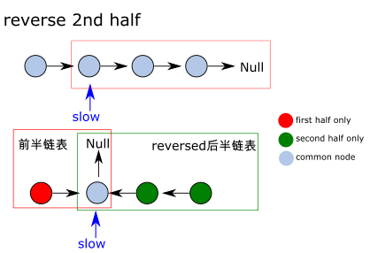
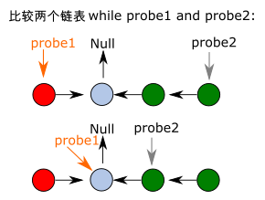

# Approach 1: in-place reverse 
<!-- Describe your approach to solving the problem. -->
这个解法包括了以下几个技巧:
- `two runner pointer`
- `reverse a linked list`

> note: in-place algo, 在concurrent setting会lock这个input till the operation on the input is done，这是in-place algo的通病

这一题的具体思路如下：
- write two helper functions:
  - `def reverse(self,head)`: return reversed linked list
  - `def mid_node(self,head)`: 找到linked list中点
- reverse the 2nd half of the linked list
- compare the first half and 2nd half from start to end
- restore the linked list by re-reverse the 2nd half


## 错误思路
我一开始的思路是直接reverse linked list, 然后比较original and reversed one就可以了, 最后发现it does't work like that, 因为我modifiy了original linked list when i was reversing, 所以自然没法让`head`和`self.reverse(head)`进行比较了;


> 小技巧: two runner pointer technique, 可以用来determine `mid node` and `end node`.


## Algorithm
<!-- Describe your first thoughts on how to solve this problem. -->
### Step1: two helper functions

For the `def reverse(self,head)`, refers to [leetcode problem 206 reverse a linked list](../206-reverse-linked-list/README.md).

For the `def mid_node(self,head)`, 有两种思路:
- traverse with couter, then do floor division to get mid node
- two runner pointer technique

two runner pointer technique设置了两个pointer moving at different pace, 由于我们是要找中点，所以设置的两个pointer, and they are `slow` and `fast` pointer, respectively. `fast`向前advancing的速度比`slow`快两倍, illustrated in the figure below


It stops until one of the next two nodes after `fast` is `null`

注意,由于panlindom linked list都拥有偶数个nodes，所以slow pointer会停在前半段的最后一个.


举个例子,如果你的`head = [1,2,3,4]` at beginning, 那么`slow = [2,3,4]` 


### Step2: reverse the 2nd half of the linked list

由于slow pointer停在前半段最后一个，reverse from slow pointer会造成如图的景象;



如果你的`head = [1,2,3,4]` at beginning, 那么`slow = [2,3,4]` ,然后你reverse了slow with `rev_half = self.reverse(slow)`,你的pointer就会变化如下:
- `head = [1,2]`
- `slow = [2]`
- `rev_half = [4,3,2]`

这种情况node with value 2被两个链表同时占有，同时`slow` pointer正好指向last non-null node in both linked list.

### Step3: compare two linked list

这一步很简单，只需要traverse两个list, 逐个比较就可以了，注意由于前半链表永远比后半链表少一个node, 循环条件要注意




### Step4: restore

It's a good practice to restore the input `head` since `head` might also be used in other functions.

`self.reverse(second_half)` 就可以了,因为它会修改second half linked list, 当你用指针`head`来traverse时，原先的断点已经被修复了

## Complexity
- Time complexity: $O(n)$
<!-- Add your time complexity here, e.g. $$O(n)$$ -->

- Space complexity: $O(1)$
<!-- Add your space complexity here, e.g. $$O(n)$$ -->


## Code
```python
# Definition for singly-linked list.
class ListNode:
    def __init__(self, val=0, next=None):
        self.val = val
        self.next = next
class Solution:
    def mid_node(self,head):
        # find the middle node with two pointer same-direction method;
        fast = head
        slow = head

        while fast.next and fast.next.next:
            slow = slow.next
            fast = fast.next.next

        return slow

    def reverse(self,head):
        # reverse the linked List

        curr,prev = head,None

        while curr:
            temp = curr.next
            curr.next = prev
            prev = curr
            curr = temp
        
        return prev


    def isPalindrome(self, head: Optional[ListNode]) -> bool:
        # in-place algorithm;

        # edge case when linked list is empty
        if head is None:
            return True

        # mid the pointer points to the middle of the linked list 
        half = self.mid_node(head)

        # reverse the 2nd half of the linked list
        rev_half = self.reverse(half)

        # 设置俩pointers分别在half和rev_half链表的start node
        probe_1 = head
        probe_2 = rev_half

        # boolean return for this function
        result = True

        while probe_1:
            if probe_1.val != probe_2.val:
                return False
            
            # advancing both pointer forward by 1
            probe_1 = probe_1.next
            probe_2 = probe_2.next
        
        # reverse the second half back, so input stays the same
        # half.next = self.reverse(rev_half)
        self.reverse(rev_half)

        return result


```